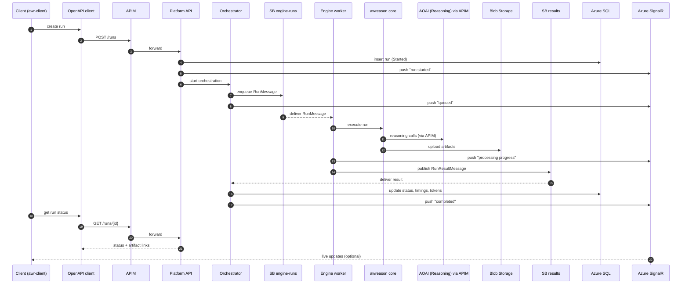

# Talent Matching Platform — Constitution

## Core Principles

### I. Typed & Auditable by Design
All entities (jobs, applications, scoring runs, aggregated results, audit events) MUST be fully typed
via `src/types/index.ts`. Every state-changing operation MUST produce an immutable ledger entry with
a correlation ID, actor, and timestamp. No silent mutations — if it changes state, it leaves a trace.

### II. Layered Architecture (NON-NEGOTIABLE)
The codebase supports two technology stacks (see Technology Stacks below). Regardless of stack,
the same layered separation MUST be maintained:

#### Stack A — React/TypeScript (current prototype)
- **Backend API** (`server/`): Express + TypeScript; storage-agnostic via `StorageProvider` interface;
  routes only in `server/routes/`; no business logic in route handlers.
- **API Client** (`src/lib/spark-client.ts`, `src/lib/api.ts`): all fetch calls go through these
  modules only; components MUST NOT call `fetch` directly.
- **UI Components** (`src/components/`): pure presentation + local state; data fetching via
  `src/lib/api.ts` only.

#### Stack B — .NET Blazor WASM / Clean Architecture (target)
- **Presentation** (Blazor WASM): Razor components, pages, and view models; citizen-facing so
  WASM hosting model is required for client-side execution without server round-trips.
- **API** (.NET Core Web API): minimal API or controller-based endpoints; follows Clean Architecture
  layering (see Principle IX).
- **Application Layer**: use cases / handlers (MediatR or similar); no direct infrastructure
  dependencies.
- **Domain Layer**: entities, value objects, domain events; zero framework dependencies.
- **Infrastructure Layer**: EF Core DbContext, repository implementations, external service
  adapters; the only layer permitted to reference `Microsoft.EntityFrameworkCore`.
- **Shared Kernel** (optional): cross-cutting contracts (DTOs, interfaces) referenced by multiple
  layers but owning no implementation.

### III. Storage Abstraction (NON-NEGOTIABLE)
All persistence goes through the `StorageProvider` interface (`server/storage/types.ts` for Stack A - equivalent for Stack B). The active
provider is selected via `STORAGE_PROVIDER` env var (`local` | `azuresql`). No component or route
may import a concrete storage implementation directly.

### IV. Security Defaults
- Passwords MUST be hashed with `crypto.subtle` SHA-256 before storage; plaintext passwords NEVER
  stored or logged.
- Role-based access MUST be enforced server-side; recruiter users can only see their own department's
  data.
- File uploads MUST be validated (type allowlist, size limit) on both client and server before
  processing.
- No secrets (`API keys`, connection strings) are ever prefixed `VITE_` (client bundle exposure).
- in the event of BLobs Storagebeing used , SAS tokens are forbidden by security policy - always use RBAC instead

### V. LLM Integration Discipline
All LLM calls MUST go through server-side proxy - in Stack A: `server/routes/llm.ts` equivalent for Sack B. The frontend calls
`/api/llm` (in stack A, and equivalent code path in stack B) only — never an LLM provider directly. Prompts MUST be constructed server-side to
prevent prompt injection from untrusted client input. JSON-mode must be used when structured output
is required.

### VI. UI Precision & Responsiveness
- Async operations MUST show loading state and handle errors with notifications.
- Optimistic updates require rollback on failure.
- Dashboard stats MUST refresh automatically (≤30-second polling interval).
- Tables with >100 rows MUST use virtual scrolling or pagination.
- All colour pairings MUST maintain ≥4.5:1 WCAG contrast ratio.

### VII. Simplicity & YAGNI
Do not add abstractions, helpers, or error handling for scenarios that cannot happen with the current
implementation. Complexity must be justified by a current requirement. Mock/simulated API data is
acceptable while a real backend is not yet connected.

### IX. Clean Architecture (.NET stack — NON-NEGOTIABLE)
When building with the .NET stack, all code MUST follow Clean Architecture:

- **Dependency rule**: dependencies point inward only — Domain ← Application ← Infrastructure /
  Presentation. No inner layer may reference an outer layer.
- **Domain layer** is the centre: entities, aggregates, value objects, domain events, and
  repository interfaces live here. Zero NuGet package dependencies beyond the BCL.
- **Application layer** contains use-case orchestration (commands, queries, handlers,
  validators). References Domain only.
- **Infrastructure layer** implements persistence (Entity Framework Core), messaging, external
  APIs. References Application and Domain.
- **Presentation layer** (Blazor WASM + .NET Core API) references Application only for
  dispatching commands/queries; never bypasses to Infrastructure directly.
- Entity Framework Core is the standard ORM for all data access and code-first migrations.
  Direct ADO.NET or raw SQL is permitted only for documented performance-critical paths.
- Solution structure MUST mirror layers: `src/Domain/`, `src/Application/`,
  `src/Infrastructure/`, `src/Web/` (or equivalent naming agreed at project start).

### VIII. System Communication Architecture
The following diagram defines how this codebase (awr-client) interacts with the platform services when not in demo/mock api mode.
All integrations MUST conform to these boundaries.

## Technology Stacks

This codebase supports two stacks. Stack A is the current prototype; Stack B is an additional target for
 for a specific customer. New features SHOULD be planned for both Stack A and Stack B.

### Stack A — React / TypeScript (prototype)

| Layer | Technology |
|---|---|
| Frontend | React 19, TypeScript, Vite 7, Tailwind CSS v4 |
| UI Components | shadcn/ui (New York style), Radix UI primitives |
| State / Data | TanStack Query (optional), `src/lib/api.ts` abstraction |
| Animations | Framer Motion |
| Icons | Phosphor Icons (`@phosphor-icons/react`) |
| Forms | React Hook Form + Zod |
| Charts | Recharts |
| Backend | Express 4, TypeScript, tsx (dev), Node 20+ |
| Storage (local) | JSON file KV store (`.data/kv-store.json`) |
| Storage (cloud) | Azure SQL via `mssql` (optional dependency) |
| LLM | OpenAI API or Azure OpenAI (server-side proxy) |
| Fonts | Space Grotesk (UI), JetBrains Mono (data/metrics) |

### Stack B — .NET Blazor WASM / Clean Architecture (target)

| Layer | Technology |
|---|---|
| Frontend | Blazor WebAssembly (.NET 9+), hosted model |
| UI Components | MudBlazor or Fluent UI Blazor (TBD at project start) |
| State / Data | Fluxor or built-in cascading state; HttpClient via typed clients |
| API | ASP.NET Core Web API (minimal APIs preferred) |
| Application | MediatR (CQRS), FluentValidation |
| ORM / Migrations | Entity Framework Core (code-first migrations) |
| Storage | Azure SQL |
| Architecture | Clean Architecture (see Principle IX) |
| Auth | Microsoft Identity / Entra ID |
| LLM | Azure OpenAI via APIM (server-side only) |

## Development Workflow

1. Features planned and tracked via speckit: `spec.md` → `plan.md` → `tasks.md` → `implement`.
2. All new UI features MUST have corresponding type definitions added to `src/types/index.ts` before
   implementation begins.
3. API shape changes MUST update the endpoint mapping table in `INTEGRATION.md`.
4. Environment variables MUST be documented in `.env.example` with comments.
5. For stack A: `npm run dev` runs both backend (`tsx watch`) and frontend (Vite) concurrently — this is the
   standard local dev command.
6. Type errors are blocking: `tsc -b --noCheck` must pass before PR merge.

## Governance

This constitution supersedes all other practices; amendments require updating this file and noting
the reason and date. All implementation tasks must be checked against these principles before
execution. Complexity that violates YAGNI (YAGNI stands for “You Aren’t Gonna Need It.”) must be explicitly justified in the relevant `plan.md`.

**Version**: 1.1.0 | **Ratified**: 2026-03-03 | **Last Amended**: 2026-03-04

### Amendment Log
| Version | Date | Change |
|---|---|---|
| 1.1.0 | 2026-03-04 | Added Stack B (.NET Blazor WASM, Clean Architecture, EF Core); added Principle IX |
