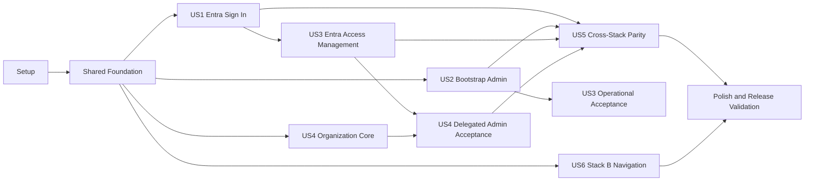

# Tasks: Entra Login, Access Management, and Stack B Workspace

**Input**: Design documents from `/specs/001-entra-login-authorization/`
**Prerequisites**: `plan.md`, `spec.md`, `research.md`, `data-model.md`, `contracts/`, `quickstart.md`

**Tests**: Test tasks are included because the specification requires negative, idempotency, concurrency, rollback, parity, accessibility, and responsive verification. Write each story's tests first and confirm they fail for the intended reason before implementing that story.

**Organization**: Tasks are grouped by the six user stories in `spec.md`. Existing Entra foundations are extended in place; no task reinstalls packages already declared in `package.json` or the .NET project files.

## Format: `[ID] [P?] [Story] Description`

- **[P]**: Can run in parallel after phase prerequisites because it changes different files and does not depend on another incomplete task in the group.
- **[Story]**: Maps the task to a user story in `spec.md`.
- Every task names the exact file or directory it changes.

## Phase 1: Setup

**Purpose**: Prepare test entry points and feature directories without changing runtime behavior.

- [X] T001 Create maintained Playwright configuration and execution scripts using the existing `@playwright/test` and `@axe-core/playwright` dependencies in playwright.config.ts and package.json
- [X] T002 [P] Create Stack A access-management module entry files in server/routes/access-management.ts, server/services/entra-access-management.ts, and server/storage/repos/access-management-repo.ts
- [X] T003 [P] Create Stack B access-management namespaces with initial contracts in dotnet/src/Application/AccessManagement/AccessManagementDtos.cs and dotnet/src/Domain/Interfaces/IEntraAccessManagementRepository.cs
- [X] T004 [P] Add non-secret Entra access-management and Stack B navigation acceptance settings consistently to .env.example, .env_local.example, .env_qa.example, and .env_prod.example

---

## Phase 2: Foundational Shared Model

**Purpose**: Establish explicit defaults, optimistic versions, schema parity, and shared authorization-context behavior required by every story.

**CRITICAL**: No user story implementation starts until this phase is complete.

- [X] T005 [P] Add failing Azure SQL schema tests for authorization version, composite default-department membership, active-default validation, and equivalent delegated-assignment uniqueness in tests/integration/authorization-schema.test.ts
- [X] T006 [P] Add failing SQLite compatibility and migration tests for default backfill, ambiguous backfill rejection, table rebuild, and foreign-key enforcement in tests/integration/authorization-sqlite-migration.test.ts
- [X] T007 [P] Add failing EF Core persistence tests for authorization version, same-user/same-organization default references, revoked history, and unique delegated assignments in dotnet/tests/Infrastructure.Tests/EntraAuthorizationPersistenceTests.cs
- [X] T008 Extend shared access aggregate, default department, authorization version, request, result, canonical error, Stack B navigation-state, and navigation-audit types in src/types/index.ts and server/storage/types.ts before UI implementation
- [X] T009 Add `AuthorizationVersion` and default-membership fields plus invariants to dotnet/src/Domain/Entities/User.cs, dotnet/src/Domain/Entities/OrganizationMembership.cs, and dotnet/src/Domain/Entities/DepartmentMembership.cs
- [X] T010 Implement guarded Azure SQL columns, candidate keys, composite default foreign key, role-assignment uniqueness, and deterministic backfill checks in server/storage/schema.sql
- [X] T011 Implement equivalent SQLite schema, indexes, active-default checks, and guarded table-rebuild migration in server/storage/schema-sqlite.sql and server/storage/db.ts
- [X] T012 Map authorization version, default relationship, candidate key, delete behavior, and assignment uniqueness in dotnet/src/Infrastructure/Persistence/AppDbContext.cs
- [X] T013 Generate and review the explicit-default and authorization-version EF migration and snapshot in dotnet/src/Infrastructure/Persistence/Migrations/
- [X] T014 Extend organization repository contracts for explicit default selection and aggregate-safe membership transitions in dotnet/src/Domain/Interfaces/IOrganizationRepository.cs and server/storage/repos/organization-repo.ts
- [X] T015 Extend user and role-assignment repositories for optimistic versions, idempotent equivalent assignments, and transaction participation, and register the access-management repository through `StorageProvider` and selected-provider construction in server/storage/repos/user-repo.ts, server/storage/repos/role-assignment-repo.ts, server/storage/types.ts, server/storage/db.ts, dotnet/src/Domain/Interfaces/IUserRepository.cs, and dotnet/src/Domain/Interfaces/IRoleAssignmentRepository.cs
- [X] T016 Update Stack A authorization resolution to reject missing, foreign, retired, or revoked defaults without treating defaults as grants in server/services/authorization.ts
- [X] T017 Update Stack B authorization resolution to return and validate explicit defaults and authorization version in dotnet/src/Application/Authorization/ResolveUserAuthorizationQuery.cs and dotnet/src/Infrastructure/Services/CurrentUserService.cs
- [X] T018 Update authorization-context conversion to select explicit defaults instead of array order in src/lib/auth.ts and dotnet/src/Web.Client/Services/ApiClient.cs
- [X] T019 Run focused schema and authorization-resolution tests from tests/integration/authorization-schema.test.ts, tests/integration/authorization-sqlite-migration.test.ts, dotnet/tests/Infrastructure.Tests/EntraAuthorizationPersistenceTests.cs, and dotnet/tests/Application.Tests/ResolveUserAuthorizationQueryTests.cs

**Checkpoint**: Azure SQL, SQLite, Stack A, and Stack B share the same explicit-default, version, assignment, and fail-closed invariants.

---

## Phase 3: User Story 1 - Sign In with Entra (Priority: P1) - MVP

**Goal**: Configured-tenant users authenticate in either stack, unassigned users remain denied but become tenant-verified pending profiles, and assigned users enter their explicit default context.

**Independent Test**: Enable Entra mode, sign in as assigned, unassigned, disabled, stale-token, and wrong-tenant identities, and verify only the assigned user receives protected access and the same explicit default in both stacks.

### Tests for User Story 1

- [X] T020 [P] [US1] Add failing Stack A tests for pending-profile upsert after valid unassigned sign-in, immutable identity reuse, wrong-tenant rejection, and no protected data in tests/integration/entra-auth.test.ts
- [X] T021 [P] [US1] Add failing Stack B tests for pending-profile upsert, explicit default context, disabled identity, stale token, and safe denial responses in dotnet/tests/Web.Tests/EntraAuthEndpointsTests.cs
- [X] T022 [P] [US1] Add failing client tests proving explicit defaults drive initial context and never broaden authorization in tests/unit/entra-auth-ui.test.tsx and dotnet/tests/Web.Tests/ApiAuthorizationMessageHandlerTests.cs

### Implementation for User Story 1

- [X] T023 [US1] Make validated configured-tenant sign-in idempotently create or refresh only a pending Entra profile before `assignment_missing` in server/services/authorization.ts and server/routes/auth.ts
- [X] T024 [US1] Implement equivalent pending-profile discovery before denial in dotnet/src/Application/Authorization/ResolveUserAuthorizationQuery.cs and dotnet/src/Web.Server/Endpoints/AuthEndpoints.cs
- [X] T025 [US1] Return `authorizationVersion` and each membership's `defaultDepartmentId` from Stack A `/api/auth/me` in server/routes/auth.ts
- [X] T026 [US1] Return the equivalent authorization context from Stack B `/api/auth/me` in dotnet/src/Web.Server/Endpoints/AuthEndpoints.cs
- [X] T027 [P] [US1] Update Stack A sign-in, access-denied, silent-refresh-once, and explicit-default client states in src/hooks/useAuth.ts, src/components/ProtectedRoute.tsx, and src/App.tsx
- [X] T028 [P] [US1] Update Stack B sign-in, access-denied, silent-refresh-once, and explicit-default client states in dotnet/src/Web.Client/App.razor, dotnet/src/Web.Client/Pages/Login.razor, and dotnet/src/Web.Client/Services/ApiClient.cs
- [X] T029 [US1] Emit correlated pending-profile, successful sign-in, denial, stale-token, disabled-identity, and logout events without token material in server/services/audit.ts and dotnet/src/Web.Server/Endpoints/AuthEndpoints.cs
- [X] T030 [US1] Run the US1 suites in tests/unit/entra-token.test.ts, tests/unit/entra-auth-ui.test.tsx, tests/integration/entra-auth.test.ts, dotnet/tests/Application.Tests/ResolveUserAuthorizationQueryTests.cs, and dotnet/tests/Web.Tests/EntraAuthEndpointsTests.cs

**Checkpoint**: User Story 1 is independently usable with fixture-backed assignments and default-deny pending profiles.

---

## Phase 4: User Story 2 - Bootstrap Database Owner as Admin (Priority: P1)

**Goal**: An operator safely establishes exactly one bootstrap Admin with an initial organization, department membership, and explicit default.

**Independent Test**: Run seed check/apply repeatedly and concurrently, verify one active bootstrap assignment and valid default, and prove wrong context or an invalid owner creates no authorization state.

### Tests for User Story 2

- [X] T031 [P] [US2] Extend seed tests for explicit bootstrap default, authorization version, ten-run idempotency, concurrent convergence, and invalid-owner rollback in tests/unit/entra-admin-seed.test.mjs
- [X] T032 [P] [US2] Add context-gate tests for exact tenant/subscription, Windows CRLF output, and no silent context switching in tests/integration/azure-context.test.ts

### Implementation for User Story 2

- [X] T033 [US2] Make the storage seed atomically converge the profile, organization, department, memberships, explicit default, bootstrap assignment, version, and audit event in infra/scripts/seed-entra-admin-data.mjs
- [X] T034 [US2] Create the check/apply wrapper and add fail-closed owner type, tenant, SQL administrator, app-role, and postcondition checks in infra/scripts/seed-entra-admin.sh and infra/scripts/bootstrap-sql-entra-users.mjs
- [X] T035 [US2] Add CRLF-safe exact tenant/subscription validation before all bootstrap discovery and mutation in infra/scripts/lib/common.sh and infra/scripts/deploy.sh
- [X] T036 [US2] Document check/apply, explicit default, repeated/concurrent convergence, and partial-state recovery in specs/001-entra-login-authorization/contracts/operator-cli.md and docs/ENTRA_AUTHORIZATION.md
- [X] T037 [US2] Run tests/unit/entra-admin-seed.test.mjs and tests/integration/azure-context.test.ts, then execute the non-changing bootstrap check from specs/001-entra-login-authorization/quickstart.md

**Checkpoint**: The verified owner can sign in as Admin; ownership, Azure RBAC, and partial bootstrap state alone grant nothing.

---

## Phase 5: User Story 3 - Onboard and Manage Entra User Access (Priority: P1)

**Goal**: Application Admins use mode-aware UI in both stacks to search, inspect, onboard, edit, disable, reactivate, and revoke Entra access atomically; simple mode retains local user management.

**Independent Test**: In each stack, onboard one pending profile into one organization with two departments, one explicit default, and one scoped role; repeat and race the request, change and revoke access, verify rollback/conflict/audit behavior, then switch to simple mode and verify only local User Management remains.

### Tests for User Story 3

- [x] T038 [P] [US3] Add failing Stack A aggregate repository tests for serializable rollback, actor revalidation, default replacement, idempotent convergence, stale versions, unrelated-scope preservation, and audit atomicity in tests/integration/entra-access-management-repository.test.ts
- [x] T039 [P] [US3] Add failing Stack A contract tests for all five access-management operations, pagination, authority boundaries, safe errors, and six repeated/concurrent onboarding attempts in tests/integration/entra-access-management.test.ts, and operator group map/assign/check/revoke convergence tests in tests/unit/entra-role-management.test.mjs
- [x] T040 [P] [US3] Add failing React tests for mode switching, search, inspect, onboarding form, explicit default, confirmation, loading, empty, validation, conflict, success, failure notifications, disable/reactivate, and targeted revoke in tests/unit/entra-access-management-ui.test.tsx
- [x] T041 [P] [US3] Add failing .NET aggregate repository tests for transactions, version conflicts, same-user default integrity, idempotency, unrelated scopes, and success/failure audit outcomes in dotnet/tests/Infrastructure.Tests/EntraAccessManagementRepositoryTests.cs
- [x] T042 [P] [US3] Add failing .NET application tests for Admin and Organization Admin list/detail/onboard/update/disable/reactivate/revoke authority in dotnet/tests/Application.Tests/EntraAccessManagementTests.cs
- [x] T043 [P] [US3] Add failing ASP.NET Core contract and bUnit tests for access-management endpoints, mode isolation, confirmation states, safe errors, and visible asynchronous failure notifications in dotnet/tests/Web.Tests/EntraAccessManagementEndpointsTests.cs and dotnet/tests/Web.Tests/EntraAccessManagementTests.cs

### Implementation for User Story 3

- [x] T044 [P] [US3] Implement exact-context operator group map/assign/check/revoke commands with Graph-to-SQL convergence, explicit defaults, targeted revocation, structured exit codes, and non-secret output in infra/scripts/manage-entra-role.sh and infra/scripts/manage-entra-role-data.mjs
- [x] T045 [P] [US3] Define Stack B commands, queries, DTOs, and validators in dotnet/src/Application/AccessManagement/AccessManagementDtos.cs, dotnet/src/Application/AccessManagement/AccessManagementCommands.cs, and dotnet/src/Application/AccessManagement/AccessManagementValidators.cs
- [x] T046 [US3] Implement Stack A actor-filtered search/detail and serializable aggregate mutation with deterministic locking in server/storage/repos/access-management-repo.ts
- [x] T047 [US3] Implement Stack A Admin/Organization Admin authority, desired-state validation, optimistic conflict handling, idempotency, and correlated aggregate audits in server/services/entra-access-management.ts
- [x] T048 [US3] Implement and mode-gate all access-management OpenAPI operations in server/routes/access-management.ts and server/index.ts
- [x] T049 [US3] Disable registration of local password user-management routes in Entra mode while preserving simple mode in server/routes/users.ts and server/index.ts
- [x] T050 [P] [US3] Add typed Stack A list/detail/put/patch/revoke transport to src/lib/api-real.ts and expose it through src/lib/api.ts
- [x] T051 [US3] Build the Stack A Entra access-management workflow, confirmation dialog, and visible asynchronous error notifications in src/components/EntraAccessManagementDialog.tsx
- [x] T052 [US3] Route Stack A's administration entry to Entra Access Management in Entra mode and local User Management in simple mode in src/components/UserMenu.tsx and src/App.tsx
- [x] T053 [US3] Implement the Stack B aggregate repository with serializable transaction, actor re-read, version update, idempotent assignment convergence, and transaction-aware success audit in dotnet/src/Infrastructure/Persistence/Repositories/EntraAccessManagementRepository.cs
- [x] T054 [US3] Implement Stack B access-management handlers and failure audit behavior in dotnet/src/Application/AccessManagement/AccessManagementHandlers.cs
- [x] T055 [US3] Implement and mode-gate the five access-management endpoint operations in dotnet/src/Web.Server/Endpoints/AccessManagementEndpoints.cs and dotnet/src/Web.Server/Program.cs
- [x] T056 [US3] Disable local password user endpoints in Entra mode while preserving simple mode in dotnet/src/Web.Server/Endpoints/UsersEndpoints.cs and dotnet/src/Web.Server/Program.cs
- [x] T057 [P] [US3] Add typed Stack B list/detail/put/patch/revoke methods and conflict mapping in dotnet/src/Web.Client/Services/ApiClient.cs
- [x] T058 [US3] Build Stack B search, inspect, onboarding, confirmation, lifecycle, targeted-revoke, and visible asynchronous error-notification states in dotnet/src/Web.Client/Components/EntraAccessManagement.razor and dotnet/src/Web.Client/Components/EntraAccessManagement.razor.css
- [x] T059 [US3] Add a mode-aware `/users` administration page that renders Entra Access Management or existing local User Management in simple mode in dotnet/src/Web.Client/Pages/UserAdministration.razor and dotnet/src/Web.Client/Layout/NavMenu.razor
- [ ] T060 [US3] Run all US3 repository, service, endpoint, operator CLI, React, and bUnit tests and execute quickstart sections 7-9 and 13 from specs/001-entra-login-authorization/quickstart.md

**Checkpoint**: Both stacks provide equivalent, atomic Entra access lifecycle management and preserve simple-mode user administration.

---

## Phase 6: User Story 4 - Administer an Organization (Priority: P2)

**Goal**: Organization Admins manage departments and delegated roles only inside assigned organizations, while job and default-department integrity remain intact.

**Independent Test**: Assign Organization Admin in one of two organizations; create/rename/retire departments and manage user access only there, while cross-organization/global escalation and invalid job/default transitions fail and audit.

### Tests for User Story 4

- [X] T061 [P] [US4] Add failing domain tests for first/last department, immutable parent, default replacement before retirement, membership integrity, and delegated-role scope in dotnet/tests/Domain.Tests/OrganizationTests.cs and dotnet/tests/Domain.Tests/RoleAssignmentTests.cs
- [X] T062 [P] [US4] Add failing Stack A organization contract tests for department lifecycle, scoped membership/default changes, delegated grants, targeted revocation, and escalation denial in tests/integration/organization-admin.test.ts
- [X] T063 [P] [US4] Add failing Stack B organization endpoint tests matching Stack A status, scope, integrity, and audit outcomes in dotnet/tests/Web.Tests/OrganizationEndpointsTests.cs
- [X] T064 [P] [US4] Add failing cross-stack job tests for required organization/department pairs and scope-specific read/mutation authorization in tests/integration/job-authorization.test.ts and dotnet/tests/Application.Tests/JobAuthorizationTests.cs

### Implementation for User Story 4

- [X] T065 [US4] Implement department lifecycle, default replacement, membership integrity, delegated-role limits, and actor-scope rules in server/services/organization-admin.ts
- [X] T066 [US4] Implement organization administration operations and canonical 400/403/404/409 responses in server/routes/organizations.ts and server/index.ts
- [X] T067 [P] [US4] Add Stack A organization administration transport and UI controls in src/lib/api-real.ts, src/lib/api.ts, and src/components/OrganizationAdmin.tsx
- [X] T068 [US4] Enforce normalized organization/department pairs and scoped reads/mutations in server/routes/jobs.ts and server/storage/repos/job-repo.ts
- [X] T069 [P] [US4] Implement Stack B organization commands, queries, validators, and repository methods in dotnet/src/Application/Organizations/ and dotnet/src/Infrastructure/Persistence/Repositories/OrganizationRepository.cs
- [X] T070 [US4] Implement Stack B organization endpoints and policy checks in dotnet/src/Web.Server/Endpoints/OrganizationEndpoints.cs and dotnet/src/Web.Server/Program.cs
- [X] T071 [P] [US4] Build Stack B organization administration transport and UI in dotnet/src/Web.Client/Services/ApiClient.cs and dotnet/src/Web.Client/Pages/OrganizationAdmin.razor
- [X] T072 [US4] Enforce job scope and Organization Admin authority in dotnet/src/Application/Jobs/ and dotnet/src/Web.Server/Endpoints/JobsEndpoints.cs
- [X] T073 [US4] Emit organization, department, membership, default replacement, delegated role, invalid job scope, and denied escalation audits in server/services/audit.ts and dotnet/src/Application/Organizations/
- [ ] T074 [US4] Run the US4 domain, contract, endpoint, and job-authorization tests and execute the Organization Admin acceptance flow in specs/001-entra-login-authorization/quickstart.md

**Checkpoint**: Organization Admin authority never escapes its organization and no change leaves invalid jobs, memberships, defaults, or role scopes.

---

## Phase 7: User Story 5 - Consistent Authorization Across Both Stacks (Priority: P2)

**Goal**: Both stacks produce identical auth, access-management, simple-mode, scope, revocation, and error outcomes from the shared model.

**Independent Test**: Run one matrix of assigned, pending, disabled, stale, wrong-tenant, multi-organization, invalid-default, revoked, conflict, and simple-mode cases against both APIs and compare all public fields and status/error codes.

### Tests for User Story 5

- [X] T075 [P] [US5] Extend the shared parity fixture with explicit defaults, authorization versions, pending profiles, access-management operations, and mode-specific results in tests/fixtures/authorization-parity-cases.json
- [X] T076 [P] [US5] Add Stack A parity execution for auth, access management, organization administration, jobs, revocation, and simple-mode isolation in tests/integration/authorization-parity.test.ts
- [X] T077 [P] [US5] Add Stack B parity execution against the same fixture in dotnet/tests/Web.Tests/AuthorizationParityTests.cs
- [X] T078 [P] [US5] Add Stack A and Stack B simple-mode regression coverage in tests/unit/auth.test.ts and dotnet/tests/Web.Tests/SimpleAuthModeTests.cs

### Implementation for User Story 5

- [X] T079 [P] [US5] Centralize canonical Stack A authorization and access-management error mapping in server/services/authorization-errors.ts
- [X] T080 [P] [US5] Centralize matching Stack B authorization and access-management error mapping in dotnet/src/Application/Authorization/AuthorizationErrorCodes.cs
- [X] T081 [US5] Add a parity runner and report command in tests/integration/run-auth-parity.ts and package.json
- [X] T082 [US5] Run the shared parity matrix and resolve every field-level difference in tests/integration/authorization-parity.test.ts and dotnet/tests/Web.Tests/AuthorizationParityTests.cs

**Checkpoint**: Every matrix case has the same allow/deny semantics, mode behavior, and public contract in both stacks.

---

## Phase 8: User Story 6 - Expand the Stack B Workspace (Priority: P2)

**Goal**: Every authenticated Stack B shell route has accessible desktop collapse and compact overlay navigation that preserves route/input state and gives released width to dense content.

**Independent Test**: Traverse every shell route at the six quickstart viewports and 200% zoom, collapse/expand with pointer and keyboard, cross routes and reload, retain unsaved input, and verify panel/table reflow with no unauthorized links or serious axe findings.

### Tests for User Story 6

- [X] T083 [P] [US6] Add failing unit tests for audited desktop preference changes, audit-failure rollback and notification, transient compact state, breakpoint transitions, route changes, and disposal in dotnet/tests/Web.Tests/NavigationShellStateTests.cs
- [X] T084 [P] [US6] Add failing endpoint and bUnit tests for server-derived actor identity, matching correlation IDs, exactly-one immutable audit outcomes, safe 400/401/503 errors, audit-failure notification, toggle/focus semantics, authorized links, body preservation, backdrop, and Escape handling in dotnet/tests/Web.Tests/NavigationAuditEndpointsTests.cs and dotnet/tests/Web.Tests/MainLayoutTests.cs
- [X] T085 [P] [US6] Add failing Playwright/axe route-inventory tests for all quickstart viewports, 200% zoom, session reload, deep links, unsaved input, width release, horizontal overflow, and the constitution's minimum 4.5:1 colour contrast in tests/e2e/stack-b-navigation.spec.ts

### Implementation for User Story 6

- [X] T086 [P] [US6] Implement scoped desktop/compact navigation state plus typed navigation-audit client contracts that retain prior state on audit failure in dotnet/src/Web.Client/Services/NavigationShellState.cs and dotnet/src/Web.Client/Services/ApiClient.cs
- [X] T087 [P] [US6] Implement maintained browser APIs for `sessionStorage`, `matchMedia`, Escape, and breakpoint notifications in dotnet/src/Web.Client/wwwroot/js/navigationShell.js
- [X] T088 [US6] Implement the navigation-audit command, immutable persistence adapter, and API endpoint, then register the endpoint, navigation shell state, and JS module lifecycle in dotnet/src/Application/Navigation/, dotnet/src/Infrastructure/Persistence/Repositories/NavigationAuditRepository.cs, dotnet/src/Web.Server/Endpoints/NavigationAuditEndpoints.cs, dotnet/src/Web.Server/Program.cs, dotnet/src/Web.Client/Program.cs, and dotnet/src/Web.Client/Layout/MainLayout.razor
- [X] T089 [US6] Move the single accessible toggle outside the sidebar, apply collapse or expansion only after audit success, retain prior state with a visible error notification on audit failure, keep `@Body` mounted, and implement compact backdrop/focus behavior in dotnet/src/Web.Client/Layout/MainLayout.razor and dotnet/src/Web.Client/Layout/NavMenu.razor
- [X] T090 [US6] Implement desktop zero-width grid state, compact off-canvas overlay, stable control sizing, visible focus, and reduced-motion behavior in dotnet/src/Web.Client/Layout/MainLayout.razor.css and dotnet/src/Web.Client/Layout/NavMenu.razor.css
- [X] T091 [P] [US6] Convert Application Detail to one/two/three-column container-responsive layout in dotnet/src/Web.Client/Pages/ApplicationDetail.razor and dotnet/src/Web.Client/Pages/ApplicationDetail.razor.css
- [X] T092 [P] [US6] Convert Manual Review to one/two/three-column container-responsive layout while preserving form state in dotnet/src/Web.Client/Pages/ManualReview.razor and dotnet/src/Web.Client/Pages/ManualReview.razor.css
- [X] T093 [US6] Add local overflow and wrapping classes for dense tables/actions in dotnet/src/Web.Client/Pages/JobDetail.razor, dotnet/src/Web.Client/Pages/Analytics.razor, dotnet/src/Web.Client/Pages/FailureQueue.razor, and dotnet/src/Web.Client/Components/UserManagement.razor
- [ ] T094 [US6] Run navigation state, bUnit, and Playwright suites and execute quickstart section 12 from specs/001-entra-login-authorization/quickstart.md

**Checkpoint**: Every authenticated Stack B shell route exposes one consistent, accessible, state-preserving navigation control at supported desktop and compact sizes.

---

## Phase 9: Polish and Cross-Cutting Concerns

**Purpose**: Complete operator guidance, security evidence, and release validation across all stories.

- [X] T095 [P] Update Entra mode, simple mode, pending-profile, access-management, explicit-default, and revocation guidance in AUTHENTICATION.md
- [X] T096 [P] Update cross-stack auth, access-management, organization, and canonical error mappings in INTEGRATION.md
- [X] T097 [P] Complete least-privilege operator guidance for bootstrap, group assignment, in-app delegation, conflicts, rollback, and wrong-context recovery in docs/ENTRA_AUTHORIZATION.md
- [X] T098 [P] Document threat review results for secretless SPAs, claim validation, no runtime Graph, transaction/audit boundaries, optimistic concurrency, and navigation authorization neutrality in SECURITY.md
- [X] T099 Extend create/reuse, stable role/scope ID, no-SPA-secret, redirect URI, bootstrap assignment, and shared-root wiring coverage in tests/unit/entra-terraform.test.ts, then run `terraform fmt -check`, `terraform validate`, and an exact-context non-changing plan for infra/terraform/modules/foundation/entra/ and infra/terraform/live/shared/
- [X] T100 Run `npm run lint`, `npm run build`, `npm run build:server`, `npm test`, and the Playwright suites defined in package.json and playwright.config.ts
- [X] T101 Run all .NET tests and release builds through dotnet/TalentMatch.slnx
- [ ] T102 Execute every acceptance and recovery step in specs/001-entra-login-authorization/quickstart.md and record results in specs/001-entra-login-authorization/checklists/implementation-validation.md
- [X] T103 [US3] Replace raw organization and department ID entry with authority-filtered named selectors, show staged role assignments, and clarify separate profile and reviewed access saves across Stack A and Stack B
- [X] T104 [US4] Populate Stack B create-job organization and department selectors from the recruiter's effective named scopes without requiring organization-administration access
- [X] T105 [US4] Replace Stack B organization administration raw target IDs with a named member selector and simplify delegated-role guidance
- [X] T106 [US4] Resolve Stack B recruiter analytics from active Entra recruiter assignments and show API failures instead of false zero metrics
- [X] T107 [US4] Apply scoped Entra recruiter analytics and visible API failure handling to Stack A

---

## Dependencies and Execution Order

### Phase Dependencies

- **Phase 1 - Setup**: No dependencies; starts immediately.
- **Phase 2 - Foundational**: Depends on Setup and blocks all user-story implementation.
- **Phase 3 - US1**: Starts after Foundational and establishes tenant-verified pending profiles and runtime authorization.
- **Phase 4 - US2**: Starts after Foundational; its final sign-in acceptance uses US1.
- **Phase 5 - US3**: Depends on US1 pending-profile discovery and the Foundational aggregate model; fixture-based repository work can begin while US2 is underway.
- **Phase 6 - US4**: Domain and service work starts after Foundational; UI acceptance uses an Organization Admin created through US2/US3 fixtures.
- **Phase 7 - US5**: Depends on US1-US4 because it certifies completed cross-stack behavior.
- **Phase 8 - US6**: Depends only on Setup and Foundational and may run in parallel with US1-US5.
- **Phase 9 - Polish**: Depends on every story selected for release.

### User Story Dependency Graph



### Within Each User Story

1. Add the story's tests and confirm they fail for the expected missing behavior.
2. Implement models/repositories before application services.
3. Implement services before endpoints and clients.
4. Implement UI after typed transport is stable.
5. Add audit behavior in the same mutation slice.
6. Run focused tests and the independent acceptance check before dependent work.

### Parallel Opportunities

- Setup tasks T002-T004 can proceed concurrently.
- Foundational test tasks T005-T007 can proceed concurrently before implementation.
- Stack A and Stack B work within US1, US3, US4, and US5 can proceed concurrently after shared contracts are stable.
- US2 tooling, US4 domain work, and all US6 navigation work can proceed in parallel after Foundational.
- Each story's `[P]` test tasks target separate test files and can be authored concurrently.
- Responsive page tasks T091 and T092 can proceed concurrently after shell state behavior is stable.

---

## Parallel Execution Examples

### User Story 1

```text
Task T020: Stack A pending-profile and denial tests in tests/integration/entra-auth.test.ts
Task T021: Stack B auth endpoint tests in dotnet/tests/Web.Tests/EntraAuthEndpointsTests.cs
Task T022: Explicit-default client tests in Stack A and Stack B test files
```

### User Story 2

```text
Task T031: Seed convergence tests in tests/unit/entra-admin-seed.test.mjs
Task T032: Azure context-gate tests in tests/integration/azure-context.test.ts
```

### User Story 3

```text
Task T038: Stack A aggregate repository tests
Task T040: React access-management UI tests
Task T041: Stack B aggregate repository tests
Task T043: ASP.NET Core endpoint and bUnit tests
```

### User Story 4

```text
Task T061: .NET organization and role domain tests
Task T062: Stack A organization contract tests
Task T063: Stack B organization endpoint tests
Task T064: Cross-stack job-scope tests
```

### User Story 5

```text
Task T075: Shared parity fixture
Task T076: Stack A parity execution
Task T077: Stack B parity execution
Task T078: Simple-mode regression tests
```

### User Story 6

```text
Task T083: Navigation state unit tests
Task T084: MainLayout bUnit tests
Task T085: Playwright route-inventory and accessibility tests
```

---

## Implementation Strategy

### MVP First

1. Complete Setup and Foundational phases.
2. Complete US1 with fixture-backed assignments.
3. Stop and validate tenant-bound sign-in, pending-profile default denial, explicit default context, token freshness, and equivalent auth responses.
4. This is the smallest independently testable MVP; add US2 and US3 before treating the environment as operationally self-service.

### Incremental Delivery

1. **US1**: Tenant-bound sign-in and default-deny pending profiles.
2. **US2**: Idempotent first Admin with a valid explicit default.
3. **US3**: In-app Entra onboarding and lifecycle management in both stacks.
4. **US4**: Delegated organization administration and job-scope integrity.
5. **US5**: Cross-stack parity certification.
6. **US6**: May ship independently after Foundation as the Stack B workspace enhancement.
7. **Polish**: Documentation, security, infrastructure, and full acceptance evidence.

### Parallel Team Strategy

1. Complete Setup and Foundational together.
2. Assign US1 Stack A and Stack B work to separate developers using the shared contract.
3. In parallel, assign US2 operator tooling, US4 domain work, and US6 navigation to separate developers.
4. Begin US3 endpoint/UI work after pending-profile and aggregate repository tests pass.
5. Reserve US5 for integration after US1-US4 are independently green.

## Notes

- `[P]` tasks still wait for their phase prerequisites.
- Every user-story task carries its `[USn]` label for traceability.
- No task adds a deprecated package; use maintained dependencies already declared by the repository.
- No task may silently switch Azure tenant/subscription or add browser secrets.
- No runtime request path may query or mutate Microsoft Graph.
- Global Admin assignment remains outside organization-scoped access-management operations.
- Commit after each task or coherent test/implementation pair.
