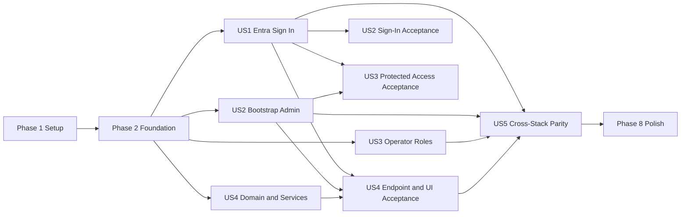

# Tasks: Entra Login and Organization Authorization

**Input**: Design documents from `/specs/001-entra-login-authorization/`
**Prerequisites**: `plan.md`, `spec.md`, `research.md`, `data-model.md`, `contracts/`, `quickstart.md`

**Tests**: Test tasks are included because the specification requires acceptance, negative, parity, idempotency, revocation, and performance verification. Write each story's tests first and confirm they fail before implementing that story.

**Organization**: Tasks are grouped by user story so each story can be implemented and tested as an independently reviewable increment.

## Format: `[ID] [P?] [Story] Description`

- **[P]**: Can run in parallel after its phase prerequisites because it changes different files and has no dependency on an incomplete task in that group.
- **[Story]**: Maps the task to a user story in `spec.md`.
- Every task names the exact file or directory it changes.

## Phase 1: Setup

**Purpose**: Add dependencies, environment contracts, and tenant-bound Terraform composition needed by the feature.

- [X] T001 [P] Add `@azure/msal-browser`, `@azure/msal-react`, `jose`, `@playwright/test`, and `@axe-core/playwright` dependencies with lockfile updates in package.json and package-lock.json
- [X] T002 [P] Add `Microsoft.Authentication.WebAssembly.Msal` aligned with .NET 10 to dotnet/src/Web.Client/TalentMatch.Web.Client.csproj
- [X] T003 [P] Document `APP_AUTH_MODE` and all non-secret Entra API, SPA, app-role, bootstrap organization, and bootstrap department variables in .env.example and .env_qa.example
- [X] T004 Add the authoritative non-secret Entra values and Terraform-output placeholders without changing tenant/subscription ownership in .env_qa_mcaps
- [X] T005 [P] Pin and configure the `azuread` provider to the declared tenant in infra/terraform/live/shared/versions.tf and infra/terraform/live/shared/providers.tf
- [X] T006 Create the reuse-aware Entra application module for the protected API, two SPA clients, delegated scope, four stable app roles, and optional role groups in infra/terraform/modules/foundation/entra/main.tf, infra/terraform/modules/foundation/entra/variables.tf, and infra/terraform/modules/foundation/entra/outputs.tf
- [X] T007 Compose the Entra module and expose its public IDs in infra/terraform/live/shared/main.tf, infra/terraform/live/shared/variables.tf, and infra/terraform/live/shared/outputs.tf
- [X] T008 [P] Consume shared Entra outputs and set Stack A App Service authentication settings in infra/terraform/live/stack-a/variables.tf and infra/terraform/live/stack-a/main.tf
- [X] T009 [P] Consume shared Entra outputs and set Stack B App Service authentication settings in infra/terraform/live/stack-b/variables.tf and infra/terraform/live/stack-b/main.tf

---

## Phase 2: Foundational Authorization Model

**Purpose**: Establish the normalized shared schema, types, repositories, audit support, and Azure safety gate that block every user story.

**CRITICAL**: No user story implementation starts until this phase is complete.

- [X] T010 Implement `validate_azure_context` with CRLF-safe exact tenant/subscription comparison and call it before discovery or mutation in infra/scripts/lib/common.sh and infra/scripts/deploy.sh
- [X] T011 [P] Define authentication provider, application roles, organizations, departments, memberships, assignments, authorization context, and safe auth errors in src/types/index.ts
- [X] T012 [P] Extend the four-role hierarchy and stable persisted values in dotnet/src/Domain/Enums/UserRole.cs
- [X] T013 [P] Create organization and immutable-parent department entities in dotnet/src/Domain/Entities/Organization.cs and dotnet/src/Domain/Entities/Department.cs
- [X] T014 [P] Create organization and department membership entities with active/revoked state in dotnet/src/Domain/Entities/OrganizationMembership.cs and dotnet/src/Domain/Entities/DepartmentMembership.cs
- [X] T015 [P] Create role-group mapping, scoped role assignment, and assignment-source/status entities in dotnet/src/Domain/Entities/RoleGroupMapping.cs and dotnet/src/Domain/Entities/RoleAssignment.cs
- [X] T016 [P] Extend Entra identity fields and simple-mode compatibility rules in dotnet/src/Domain/Entities/User.cs
- [X] T017 [P] Add normalized organization and department foreign keys to jobs in dotnet/src/Domain/Entities/Job.cs
- [X] T018 [P] Add guarded Azure SQL tables, indexes, constraints, user backfill, job-scope backfill, and composite organization/department foreign keys in server/storage/schema.sql
- [X] T019 [P] Add equivalent SQLite tables, indexes, constraints, user backfill, and job-scope migration behavior in server/storage/schema-sqlite.sql
- [X] T020 Register all new shared table identifiers in server/storage/table-names.ts
- [X] T021 [P] Implement transactional organization, department, and membership persistence in server/storage/repos/organization-repo.ts
- [X] T022 [P] Implement group mapping and scoped assignment activation/revocation queries in server/storage/repos/role-assignment-repo.ts
- [X] T023 [P] Add immutable tenant/object identity lookup, Entra profile upsert, active-state, and last-login operations in server/storage/repos/user-repo.ts
- [X] T024 [P] Replace free-text authorization filters with normalized organization/department job queries and pair validation in server/storage/repos/job-repo.ts
- [X] T025 Create the minimal `StorageProvider` repository contract in server/storage/types.ts and expose the new repositories through server/storage/repos/index.ts and the active provider in server/storage/db.ts
- [X] T026 [P] Define organization, membership, and scoped assignment repository contracts in dotnet/src/Domain/Interfaces/IOrganizationRepository.cs and dotnet/src/Domain/Interfaces/IRoleAssignmentRepository.cs
- [X] T027 Extend Entra identity and active-user operations in dotnet/src/Domain/Interfaces/IUserRepository.cs
- [X] T028 Map new entities, filtered indexes, composite keys, check constraints, and schema relationships in dotnet/src/Infrastructure/Persistence/AppDbContext.cs
- [X] T029 Generate and review the `AddEntraOrganizationAuthorization` EF Core migration and model snapshot in dotnet/src/Infrastructure/Persistence/Migrations/
- [X] T030 [P] Implement EF Core organization, department, and membership persistence in dotnet/src/Infrastructure/Persistence/Repositories/OrganizationRepository.cs
- [X] T031 [P] Implement EF Core scoped assignment and group-mapping persistence in dotnet/src/Infrastructure/Persistence/Repositories/RoleAssignmentRepository.cs
- [X] T032 Add Entra identity lookup and profile updates to dotnet/src/Infrastructure/Persistence/Repositories/UserRepository.cs
- [X] T033 Extend the existing append-only audit stream with authorization event names and safe actor, subject, scope, result, and correlation details without token material in server/services/audit.ts, server/storage/repos/audit-repo.ts, dotnet/src/Domain/Entities/ProcessingEvent.cs, and dotnet/src/Domain/Interfaces/IProcessingEventRepository.cs

**Checkpoint**: Both storage providers and the .NET model enforce identical organization, department, membership, job-scope, assignment, and audit invariants.

---

## Phase 3: User Story 1 - Sign In with Entra (Priority: P1) - MVP

**Goal**: Users from the configured tenant can authenticate in either stack, receive only SQL-backed scoped authorization, refresh stale tokens once, and see a safe access-denied state when unassigned.

**Independent Test**: Enable Entra mode, authenticate one assigned and one unassigned configured-tenant identity, and verify that only the assigned identity receives `/api/auth/me` context and protected UI/API access.

### Tests for User Story 1

- [X] T034 [P] [US1] Add failing token-validation tests for signature, issuer, tenant, audience, `azp`, scope, lifetime, 15-minute age, roles, groups, and overage in tests/unit/entra-token.test.ts
- [X] T035 [P] [US1] Add failing Stack A `/api/auth/me` and `/api/auth/logout` contract tests for assigned, unassigned, disabled, wrong-tenant, stale-token, and safe-error cases in tests/integration/entra-auth.test.ts
- [X] T036 [P] [US1] Add failing React tests for sign-in, loading, silent refresh, access denied, logout, and no-password-fallback states in tests/unit/entra-auth-ui.test.tsx
- [X] T037 [P] [US1] Add failing .NET authorization-resolution tests for bootstrap, group, delegated, missing-membership, stale-token, and cross-scope cases in dotnet/tests/Application.Tests/ResolveUserAuthorizationQueryTests.cs
- [X] T038 [P] [US1] Add failing ASP.NET Core `/api/auth/me` and `/api/auth/logout` contract tests matching Stack A status/error/context behavior in dotnet/tests/Web.Tests/EntraAuthEndpointsTests.cs

### Implementation for User Story 1

- [X] T039 [P] [US1] Implement cached OIDC/JWKS bearer validation and normalized Entra claims in server/services/entra-token.ts
- [X] T040 [US1] Implement SQL-backed membership and per-resource role hierarchy resolution in server/services/authorization.ts
- [X] T041 [US1] Switch Entra-mode request authentication to bearer validation and attach authorization context in server/middleware/auth.ts
- [X] T042 [P] [US1] Define Express request claim/context augmentation in server/types.d.ts and isolate simple sessions from Entra context in server/session.ts
- [X] T043 [US1] Implement the `auth-api.openapi.yaml` `/api/auth/me` and `/api/auth/logout` behavior while preserving explicit simple mode in server/routes/auth.ts
- [X] T044 [US1] Record successful/denied sign-in, logout, stale token, missing assignment, disabled identity, and scope failures through server/services/audit.ts
- [X] T045 [P] [US1] Configure the Stack A public client, tenant authority, API scope, redirect handling, and MSAL provider in src/lib/msal-config.ts and src/main.tsx
- [X] T046 [US1] Implement Entra-aware sign-in, current-context, silent-refresh-once, and logout behavior in src/lib/auth.ts and src/hooks/useAuth.ts
- [X] T047 [US1] Keep token attachment and one idempotent `token_stale` retry internal to src/lib/api-real.ts, and expose authenticated operations only through the public facade in src/lib/api.ts
- [X] T048 [US1] Add protected-route, loading, identity-provider error, access-denied, and Entra logout UI while hiding password workflows in src/components/ProtectedRoute.tsx, src/components/LoginForm.tsx, src/components/UserMenu.tsx, and src/App.tsx
- [X] T049 [P] [US1] Configure single-tenant JWT bearer validation, delegated scope, client allowlist, and authorization services in dotnet/src/Web.Server/Program.cs
- [X] T050 [US1] Implement authorization-context resolution and extend current-user contracts in dotnet/src/Application/Authorization/ResolveUserAuthorizationQuery.cs and dotnet/src/Application/Common/Interfaces/ICurrentUserService.cs
- [X] T051 [US1] Resolve persisted memberships and assignments from validated claims in dotnet/src/Infrastructure/Services/CurrentUserService.cs
- [X] T052 [US1] Implement matching `/api/auth/me` and `/api/auth/logout` responses, safe error codes, and existing-stream audit emission through `IProcessingEventRepository` in dotnet/src/Web.Server/Endpoints/AuthEndpoints.cs
- [X] T053 [US1] Configure Blazor MSAL authorization, token-aware API calls, authorized routing, loading/error states, and logout in dotnet/src/Web.Client/Program.cs, dotnet/src/Web.Client/App.razor, dotnet/src/Web.Client/Pages/Login.razor, dotnet/src/Web.Client/Services/ApiClient.cs, and dotnet/src/Web.Client/Components/UserMenu.razor
- [X] T054 [US1] Disable password login/reset/change, default-admin initialization, and fallback behavior only when `APP_AUTH_MODE=entra` in server/routes/auth.ts, server/services/init-users.ts, and dotnet/src/Web.Server/Endpoints/AuthEndpoints.cs

**Checkpoint**: User Story 1 passes independently with fixture-backed assignments and equivalent Stack A/Stack B authorization contexts.

---

## Phase 4: User Story 2 - Bootstrap Database Owner as Admin (Priority: P1)

**Goal**: An operator can safely and idempotently register the verified Azure SQL Entra administrator in an initial organization/department and grant exactly one global Admin assignment.

**Independent Test**: Run `check`, run `apply` twice plus concurrent attempts, and verify one organization, one department, both memberships, one direct Admin app-role assignment, one active SQL bootstrap assignment, and fail-closed wrong-context behavior.

### Tests for User Story 2

- [ ] T055 [P] [US2] Add failing Bash-wrapper tests for exact tenant/subscription acceptance, CRLF output, wrong context, and no silent context switching in tests/integration/azure-context.test.ts
- [ ] T056 [P] [US2] Add failing storage CLI tests for owner verification, transactional bootstrap membership, idempotency, non-interactive rejection, and audit outcomes in tests/unit/entra-admin-seed.test.ts
- [ ] T057 [P] [US2] Add failing integration tests that run the bootstrap seed exactly 10 times with at least two concurrent attempts and assert one active assignment, Graph/SQL partial-failure denial, and rerun convergence in tests/integration/entra-admin-seed.test.ts

### Implementation for User Story 2

- [ ] T058 [P] [US2] Implement non-secret Microsoft Graph app-role assignment lookup/upsert helpers with structured exit handling in infra/scripts/lib/entra-graph.sh
- [ ] T059 [US2] Implement transactional `check` and `apply` storage operations for the Entra profile, initial organization/department, memberships, bootstrap assignment, and audit events in server/cli/seed-entra-admin.ts
- [ ] T060 [US2] Implement owner/context validation, direct Admin app-role convergence, storage CLI invocation, and postcondition checks in infra/scripts/seed-entra-admin.sh
- [ ] T061 [US2] Add an end-to-end bootstrap-admin authorization test proving database ownership and Azure RBAC alone do not grant access in tests/integration/entra-admin-access.test.ts
- [ ] T062 [US2] Write the first-admin bootstrap runbook section covering prerequisites, `check|apply`, idempotency, partial-state recovery, and initial organization/department inputs in docs/ENTRA_AUTHORIZATION.md

**Checkpoint**: The verified owner can sign in as global Admin after seeding, while every invalid or partial bootstrap state remains denied.

---

## Phase 5: User Story 3 - Assign and Revoke Other User Roles (Priority: P2)

**Goal**: Platform operators can map Entra groups, assign users to valid organization/department scopes, inspect state, and revoke one assignment without granting Azure or SQL privileges or disturbing unrelated scopes.

**Independent Test**: Map and assign each supported scoped role to fresh tenant users, inspect both Entra and SQL state, reject invalid pairs, revoke a targeted assignment, and verify immediate scoped denial with unrelated assignments retained.

### Tests for User Story 3

- [ ] T063 [P] [US3] Add failing map-group tests for role scope rules, immutable IDs, P1/P2 group behavior, nested-group rejection, and app-role verification in tests/unit/entra-role-management.test.ts
- [ ] T064 [P] [US3] Add failing assign/check/revoke tests for multi-organization membership, invalid department pairs, targeted revocation, shared-group retention, and partial-state exit codes in tests/integration/entra-role-management.test.ts
- [ ] T065 [P] [US3] Add failing Stack A authorization tests for Recruiter and Analytics Viewer allowed/denied actions after assignment and revocation in tests/integration/scoped-role-access.test.ts
- [ ] T066 [P] [US3] Add failing .NET tests for matching Recruiter and Analytics Viewer scope enforcement and immediate SQL revocation in dotnet/tests/Application.Tests/ScopedRoleAuthorizationTests.cs

### Implementation for User Story 3

- [ ] T067 [US3] Implement mapping validation plus transactional assign, check, and targeted revoke storage commands in server/cli/manage-entra-role.ts
- [ ] T068 [US3] Implement the operator CLI contract, context gate, Graph group/app-role operations, SQL-first revocation, structured output, and exit codes in infra/scripts/manage-entra-role.sh
- [ ] T069 [US3] Emit assignment, membership, mapping, revocation, partial-state, actor, subject, and correlation audit details through server/services/audit.ts
- [ ] T070 [US3] Write the platform-operator role lifecycle section covering managed groups, multi-organization examples, least privilege, verification, conflict recovery, and rollback in docs/ENTRA_AUTHORIZATION.md
- [ ] T071 [US3] Add a documented operator acceptance script that runs map, assign, check, scoped-access, revoke, and recovery checks in infra/scripts/verify-entra-role-management.sh

**Checkpoint**: Operator-managed roles are repeatable, least-privileged, auditable, and scoped independently for every organization/department.

---

## Phase 6: User Story 4 - Administer an Organization (Priority: P2)

**Goal**: Organization Admins can manage departments, memberships, and delegated roles only inside assigned organizations, and every job is bound to a valid organization-owned department.

**Independent Test**: Give a user Organization Admin in one of two organizations; verify department and role management succeeds only there, cross-organization/global changes are denied, and invalid job pairs or orphaning changes are rejected.

### Tests for User Story 4

- [ ] T072 [P] [US4] Add failing domain tests for first-department creation, immutable department parent, last-department retirement, and membership invariants in dotnet/tests/Domain.Tests/OrganizationTests.cs
- [ ] T073 [P] [US4] Add failing domain tests for delegated assignment scope, hierarchy, multi-scope coexistence, and targeted revocation in dotnet/tests/Domain.Tests/RoleAssignmentTests.cs
- [ ] T074 [P] [US4] Add failing Stack A contract tests for every operation and denial in `organization-admin.openapi.yaml` in tests/integration/organization-admin.test.ts
- [ ] T075 [P] [US4] Add failing ASP.NET Core contract tests for matching organization, department, membership, grant, and revoke responses in dotnet/tests/Web.Tests/OrganizationEndpointsTests.cs
- [ ] T076 [P] [US4] Add failing Stack A job tests for required scope IDs, mismatched pairs, cross-scope reads/mutations, and legacy backfill failures in tests/integration/job-authorization.test.ts
- [ ] T077 [P] [US4] Add failing .NET job tests for the same organization/department pair and role hierarchy rules in dotnet/tests/Application.Tests/JobAuthorizationTests.cs
- [ ] T078 [P] [US4] Add failing React tests for organization selection, department management, member registration, delegated grants, targeted revoke, loading, rollback, and safe errors in tests/unit/organization-admin-ui.test.tsx
- [ ] T079 [P] [US4] Add failing cross-organization and global-Admin escalation audit tests in dotnet/tests/Web.Tests/OrganizationAdminAuthorizationTests.cs

### Implementation for User Story 4

- [ ] T080 [US4] Implement transactional organization, department, membership, delegated-role, orphan-prevention, and actor-scope rules in server/services/organization-admin.ts
- [ ] T081 [US4] Implement every `organization-admin.openapi.yaml` operation and safe 400/403/404/409 mapping in server/routes/organizations.ts
- [ ] T082 [US4] Register organization routes and enforce global/organization-scoped middleware in server/index.ts and server/middleware/rbac.ts
- [ ] T083 [US4] Add typed organization administration transport in src/lib/api-real.ts and expose it only through the public facade in src/lib/api.ts
- [ ] T084 [US4] Build organization selector, department controls, membership editor, delegated role controls, targeted revoke, loading/error states, and optimistic rollback in src/components/OrganizationAdmin.tsx and src/App.tsx
- [ ] T085 [US4] Enforce normalized organization/department creation, update, list, and mutation scope in server/routes/jobs.ts and server/storage/repos/job-repo.ts
- [ ] T086 [P] [US4] Implement organization, department, membership, grant, revoke, and hierarchy commands/queries in dotnet/src/Application/Organizations/ and dotnet/src/Application/Authorization/
- [ ] T087 [US4] Implement `organization-admin.openapi.yaml` endpoints and policy checks in dotnet/src/Web.Server/Endpoints/OrganizationEndpoints.cs and register them in dotnet/src/Web.Server/Program.cs
- [ ] T088 [US4] Add typed organization administration methods to dotnet/src/Web.Client/Services/ApiClient.cs
- [ ] T089 [US4] Build organization selection and administration UI with loading, safe errors, and rollback in dotnet/src/Web.Client/Components/OrganizationSelector.razor and dotnet/src/Web.Client/Pages/OrganizationAdmin.razor
- [ ] T090 [US4] Validate organization/department pairs and actor scope when creating or updating jobs in dotnet/src/Application/Jobs/Commands/CreateJobCommand.cs and related job update handlers
- [ ] T091 [US4] Apply scoped list/read/mutation authorization to dotnet/src/Web.Server/Endpoints/JobsEndpoints.cs and surface active scope in dotnet/src/Web.Client/Pages/Dashboard.razor
- [ ] T092 [US4] Record organization, department, membership, delegated grant/revoke, invalid job scope, and denied escalation events in server/services/audit.ts and dotnet/src/Application/Organizations/

**Checkpoint**: Organization Admin authority cannot escape its organization, and no active job, membership, mapping, or assignment can reference an invalid department scope.

---

## Phase 7: User Story 5 - Consistent Authorization Across Both Stacks (Priority: P2)

**Goal**: Stack A and Stack B return identical authorization contexts, safe error codes, role/scope outcomes, session freshness behavior, and explicit simple-mode isolation.

**Independent Test**: Execute one shared matrix of valid, unassigned, disabled, stale, wrong-tenant, multi-organization, revoked, and invalid-job identities against both stacks and compare status, error, role, memberships, authorizations, and scope.

### Tests for User Story 5

- [ ] T093 [P] [US5] Define the shared parity matrix for all roles, assignment sources, memberships, negative cases, and expected error/status values in tests/fixtures/authorization-parity-cases.json
- [ ] T094 [US5] Execute the shared matrix against Stack A auth, job, and organization endpoints in tests/integration/authorization-parity.test.ts
- [ ] T095 [US5] Execute the same shared matrix against Stack B auth, job, and organization endpoints in dotnet/tests/Web.Tests/AuthorizationParityTests.cs
- [ ] T096 [P] [US5] Add simple-mode regression tests proving existing local login remains isolated and Entra data is never a fallback in tests/unit/auth.test.ts
- [ ] T097 [P] [US5] Add matching .NET simple-mode isolation tests in dotnet/tests/Web.Tests/SimpleAuthModeTests.cs
- [ ] T098 [P] [US5] Add Stack A stale-token refresh-once and interaction-required tests in tests/unit/entra-token-refresh.test.ts
- [X] T099 [P] [US5] Add Blazor stale-token refresh-once and interaction-required tests in dotnet/tests/Web.Tests/EntraTokenRefreshTests.cs

### Implementation for User Story 5

- [ ] T100 [P] [US5] Centralize canonical authorization error codes and response mapping for Stack A in server/services/authorization-errors.ts
- [ ] T101 [P] [US5] Centralize the same canonical authorization error codes and response mapping for Stack B in dotnet/src/Application/Authorization/AuthorizationErrorCodes.cs
- [ ] T102 [US5] Add a parity runner that starts or targets both APIs, executes the shared matrix, and reports field-level differences in tests/integration/run-auth-parity.ts and package.json

**Checkpoint**: Every shared matrix case produces the same allow/deny semantics and public contract in both stacks.

---

## Phase 8: Polish and Cross-Cutting Concerns

**Purpose**: Complete operator guidance, integration mapping, security review, performance evidence, and full validation.

- [ ] T103 [P] Write the shared tenant setup, role hierarchy, membership model, Organization Admin delegation, and troubleshooting sections, then assemble and cross-link the bootstrap and operator lifecycle sections in docs/ENTRA_AUTHORIZATION.md
- [ ] T104 [P] Update production Entra mode versus local simple mode behavior and remove obsolete password-first guidance in AUTHENTICATION.md
- [ ] T105 [P] Add Stack A/Stack B auth and organization endpoint parity mappings to INTEGRATION.md
- [ ] T106 [P] Add a release-mode authorization benchmark for each API against QA Azure SQL using a 60-second warm-up, 20,000 requests, 25 concurrent clients, 10,000 users, 100 organizations, 1,000 departments, 100,000 assignments, and a 20-assignment identity, asserting less than 100-ms server-side p95 in tests/integration/authorization-performance.test.ts
- [ ] T107 Document the completed threat/security review for secretless SPAs, exact issuer/audience/client validation, no runtime Graph, no token logging, fail-closed scope, and least privilege in docs/ENTRA_AUTHORIZATION_SECURITY_REVIEW.md
- [ ] T108 [P] Add Playwright/axe desktop and mobile tests for WCAG 4.5:1 contrast, keyboard access, loading/error states, optimistic rollback, responsive layout, and pagination or virtualization in tests/e2e/entra-authorization-accessibility.spec.ts and playwright.config.ts
- [ ] T109 [P] Add EF Core repository and migration tests for identity uniqueness, organization/department ownership, membership integrity, scoped assignments, filtered indexes, revocation history, and audit persistence in dotnet/tests/Infrastructure.Tests/EntraAuthorizationPersistenceTests.cs
- [ ] T110 [P] Add shared-schema parity tests that execute equivalent authorization fixtures and constraint failures against SQLite and Azure SQL definitions in dotnet/tests/Infrastructure.Tests/AuthorizationSchemaParityTests.cs
- [ ] T111 Run `terraform fmt -check`, `terraform validate`, and an exact-context non-changing shared plan for infra/terraform/modules/foundation/entra/ and infra/terraform/live/shared/
- [ ] T112 Run `npm run lint`, `npm run build`, `npm run build:server`, `npm test`, and the Playwright accessibility suite using package.json
- [ ] T113 Run all .NET tests and release builds through dotnet/TalentMatch.slnx
- [ ] T114 Execute every acceptance and recovery step in specs/001-entra-login-authorization/quickstart.md and record results in specs/001-entra-login-authorization/checklists/implementation-validation.md

---

## Dependencies and Execution Order

### Phase Dependencies

- **Phase 1 - Setup**: No dependencies; starts immediately.
- **Phase 2 - Foundational**: Depends on Setup and blocks all user stories.
- **Phase 3 - US1**: Starts after Foundational and provides the authentication/runtime authorization surface.
- **Phase 4 - US2**: Implementation starts after Foundational; full sign-in acceptance uses US1.
- **Phase 5 - US3**: Implementation starts after Foundational; production operator acceptance uses the bootstrap Admin from US2 and protected APIs from US1.
- **Phase 6 - US4**: Domain/application work starts after Foundational; endpoint/UI acceptance depends on US1 and an Organization Admin assignment supplied by US2 or US3 fixtures.
- **Phase 7 - US5**: Depends on US1-US4 because it verifies completed cross-stack parity.
- **Phase 8 - Polish**: Depends on every story included in the release.

### User Story Dependency Graph



### Within Each User Story

1. Add tests and confirm they fail for the intended reason.
2. Implement domain/storage behavior before services.
3. Implement services before endpoints and UI.
4. Add audit behavior with the state-changing operation.
5. Run the story's focused tests and independent acceptance check before starting dependent work.

### Parallel Opportunities

- Node, .NET, environment, and Terraform setup tasks marked `[P]` can proceed concurrently.
- Type/entity/schema tasks T011-T019 can proceed concurrently from the approved data model.
- Stack A repositories T021-T024 can proceed concurrently; .NET repositories T030-T031 can proceed concurrently after entity/DbContext work.
- Test tasks within each story can be authored concurrently in separate files.
- After Foundational, US2 operator tooling and US4 domain/application work can proceed alongside US1, while their end-to-end acceptance waits for authentication.
- Stack A and Stack B implementations within a story can proceed concurrently when their shared contract and schema dependencies are complete.

---

## Parallel Execution Examples

### User Story 1

```text
Task T034: Stack A token-validation tests in tests/unit/entra-token.test.ts
Task T036: React auth-state tests in tests/unit/entra-auth-ui.test.tsx
Task T037: .NET authorization-resolution tests in dotnet/tests/Application.Tests/ResolveUserAuthorizationQueryTests.cs
Task T038: ASP.NET auth endpoint tests in dotnet/tests/Web.Tests/EntraAuthEndpointsTests.cs
```

### User Story 2

```text
Task T055: Azure-context wrapper tests in tests/integration/azure-context.test.ts
Task T056: Bootstrap storage CLI tests in tests/unit/entra-admin-seed.test.ts
Task T057: Bootstrap convergence tests in tests/integration/entra-admin-seed.test.ts
```

### User Story 3

```text
Task T063: Group mapping tests in tests/unit/entra-role-management.test.ts
Task T064: Operator lifecycle tests in tests/integration/entra-role-management.test.ts
Task T066: .NET scoped-role tests in dotnet/tests/Application.Tests/ScopedRoleAuthorizationTests.cs
```

### User Story 4

```text
Task T072: Organization invariant tests in dotnet/tests/Domain.Tests/OrganizationTests.cs
Task T074: Stack A organization contract tests in tests/integration/organization-admin.test.ts
Task T075: Stack B organization contract tests in dotnet/tests/Web.Tests/OrganizationEndpointsTests.cs
Task T078: React organization administration tests in tests/unit/organization-admin-ui.test.tsx
```

### User Story 5

```text
Task T096: Stack A simple-mode isolation tests in tests/unit/auth.test.ts
Task T097: Stack B simple-mode isolation tests in dotnet/tests/Web.Tests/SimpleAuthModeTests.cs
Task T098: Stack A token-refresh tests in tests/unit/entra-token-refresh.test.ts
Task T099: Stack B token-refresh tests in dotnet/tests/Web.Tests/EntraTokenRefreshTests.cs
```

---

## Implementation Strategy

### MVP First

1. Complete Setup and Foundational phases.
2. Complete US1 with fixture-backed assignments.
3. Stop and validate tenant-bound sign-in, default denial, token freshness, and equivalent auth context in both stacks.
4. This is the smallest technical MVP; add US2 before deploying an independently operable environment.

### Deployment-Ready First Increment

1. Complete Setup, Foundational, US1, and US2.
2. Validate the bootstrap owner can sign in and that ownership/RBAC without application assignment remains denied.
3. Deploy only after the exact-context policy read and non-changing Terraform plan succeed for `.env_qa_mcaps`.

### Incremental Delivery

1. US1: Tenant-bound authentication and default-deny authorization.
2. US2: Idempotent first Admin and initial organization/department.
3. US3: Repeatable operator-managed role lifecycle.
4. US4: Delegated Organization Admin and normalized job scope.
5. US5: Cross-stack parity certification.
6. Polish: Documentation, security review, performance evidence, and full quickstart validation.

### Parallel Team Strategy

1. Complete Setup and Foundational together.
2. Assign Stack A and Stack B authentication work in US1 to separate developers using the same contracts.
3. In parallel, assign US2 Bash/CLI work and US4 Domain/Application work to separate developers.
4. Begin endpoint/UI work only after focused domain/service tests pass.
5. Reserve US5 for integration after US1-US4 are independently green.

## Notes

- `[P]` tasks change separate files but still wait for their phase prerequisites.
- Story labels provide requirement traceability to `spec.md`.
- Group-based assignment requires Microsoft Entra ID P1/P2; delegated application assignments do not.
- No task may silently switch Azure tenant/subscription or add browser secrets.
- No runtime request path may query or mutate Microsoft Graph.
- Commit after each task or coherent test/implementation pair.
