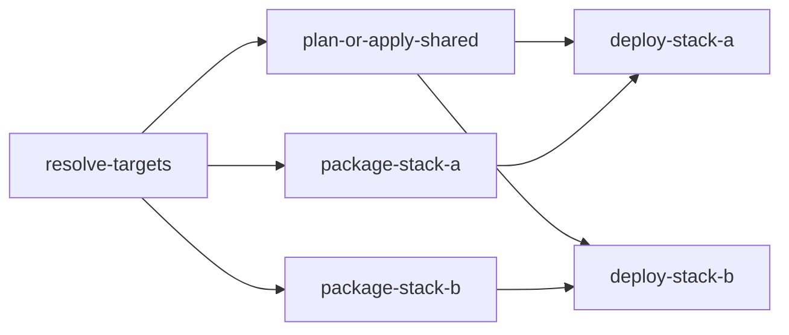

# Contract: Selective Azure Deployment Workflow

**Feature**: 006-selective-azure-deploy
**Date**: 2026-04-17

> Defines the single GitHub Actions workflow interface and the Bash-script inputs it must honor.

## selective-azure-deploy.yml

### Triggers

| Trigger | Config |
|---------|--------|
| `push` | Branches: `main`, `develop` |
| `workflow_dispatch` | Manual trigger with explicit environment and target selection |

### workflow_dispatch Inputs

| Input | Type | Required | Options | Default | Description |
|-------|------|----------|---------|---------|-------------|
| `environment` | choice | yes | `development`, `staging`, `production` | `development` | GitHub environment used for Azure login and environment mapping |
| `target` | choice | yes | `shared-only`, `stack-a`, `stack-b`, `both` | `both` | Which deployment scopes to run |
| `action` | choice | yes | `plan`, `apply` | `apply` | Terraform action to execute |

### Resolved Outputs From `resolve-targets.sh`

| Output | Type | Description |
|--------|------|-------------|
| `tf_environment` | string | `dev`, `test`, or `prod` |
| `env_file` | string | `.env_local`, `.env_qa`, or `.env_prod` |
| `deploy_shared` | string (`true`/`false`) | Whether shared root must be applied |
| `deploy_stack_a` | string (`true`/`false`) | Whether Stack A packaging and deploy steps must run |
| `deploy_stack_b` | string (`true`/`false`) | Whether Stack B packaging and deploy steps must run |
| `package_stack_a` | string (`true`/`false`) | Whether Stack A build/package should run |
| `package_stack_b` | string (`true`/`false`) | Whether Stack B publish/package should run |

### Path Detection Scope

```yaml
filters: |
  shared:
    - 'infra/**'
    - '.github/workflows/**'
    - '.env_*.example'
  stack_a:
    - 'src/**'
    - 'server/**'
    - 'package.json'
    - 'package-lock.json'
    - 'vite.config.ts'
    - 'tsconfig*.json'
    - 'tailwind.config.js'
  stack_b:
    - 'dotnet/**'
```

### Branch Mapping

| Branch | GitHub Environment | Terraform Environment |
|--------|--------------------|-----------------------|
| `develop` | `staging` | `test` |
| `main` | `production` | `prod` |

Pushes to other branches do not auto-deploy.

---

## Job Shape

### 1. `resolve-targets`

- Checks out the repo.
- Runs changed-path detection for push events.
- Applies manual `workflow_dispatch` target override when present.
- Maps the GitHub environment to the Terraform environment and env file.

### 2. `plan-or-apply-shared`

- Runs only when `deploy_shared == 'true'`.
- Uses `azure/login@v2` with OIDC.
- Invokes `infra/scripts/deploy.sh <env-file> <tf-environment> <action> shared-only`.

### 3. `package-stack-a`

- Runs only when `package_stack_a == 'true'`.
- Runs `npm ci`, `npm run build`, and `npm run build:server`.
- Invokes `infra/scripts/package-stack-a.sh`.

### 4. `package-stack-b`

- Runs only when `package_stack_b == 'true'`.
- Runs `dotnet test dotnet/TalentMatch.slnx` and `dotnet publish dotnet/src/Web.Server/TalentMatch.Web.Server.csproj`.
- Invokes `infra/scripts/package-stack-b.sh`.

### 5. `deploy-stack-a`

- Runs only when `deploy_stack_a == 'true'`.
- Waits for shared apply when shared changes are in scope.
- Invokes `infra/scripts/deploy.sh <env-file> <tf-environment> <action> stack-a`.

### 6. `deploy-stack-b`

- Runs only when `deploy_stack_b == 'true'`.
- Waits for shared apply when shared changes are in scope.
- Invokes `infra/scripts/deploy.sh <env-file> <tf-environment> <action> stack-b`.

---

## Dependency Graph



Execution rules:

- Shared runs before any stack deployment when shared changes are required.
- Stack A and Stack B package and deploy jobs can run in parallel once their dependencies are satisfied.
- Manual `target` selection overrides changed-path detection.

---

## Required Repository Configuration

### Environments

| Environment | Protection |
|-------------|------------|
| `development` | None |
| `staging` | Optional reviewer |
| `production` | Required reviewer |

### Required Secrets

| Secret | Description |
|--------|-------------|
| `AZURE_CLIENT_ID` | Federated deployment app registration client ID |
| `AZURE_TENANT_ID` | Azure tenant ID |
| `AZURE_SUBSCRIPTION_ID` | Azure subscription ID |

### Required Workflow Permissions

```yaml
permissions:
  id-token: write
  contents: read
```