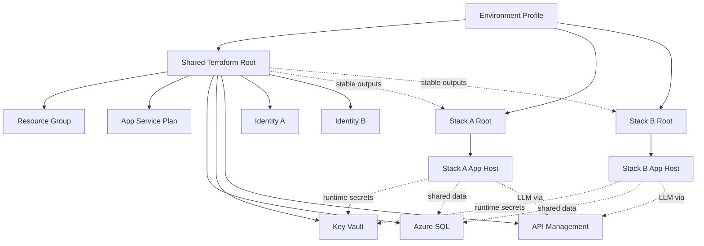
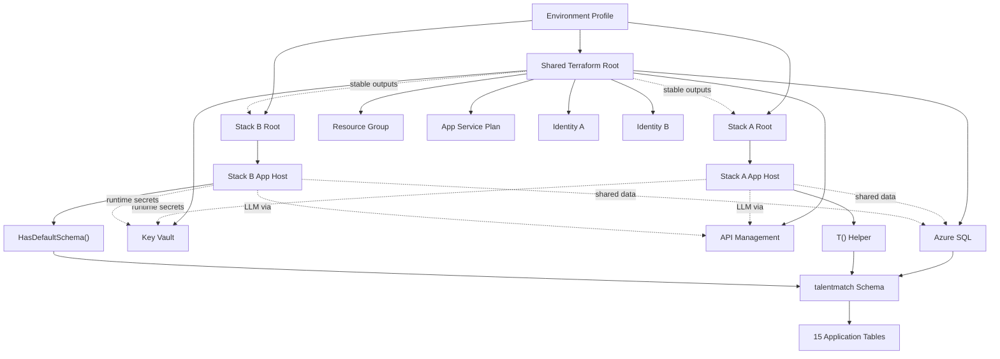
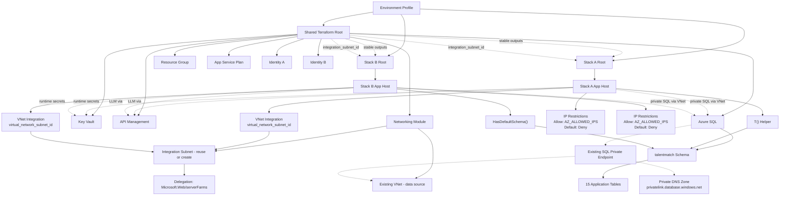

# Data Model: Selective Azure Deployment

**Feature**: 006-selective-azure-deploy
**Date**: 2026-04-17

> This feature models deployment state, reusable Azure resources, environment profiles,
> and workflow decisions rather than application-domain entities.

## Core Deployment Entities

### 1. Environment Profile

Represents one deployment configuration file consumed by Bash wrappers and GitHub Actions.

| Property | Type | Description |
|----------|------|-------------|
| fileName | string | `.env_local`, `.env_qa`, or `.env_prod` |
| tfEnvironment | enum | `dev` \| `test` \| `prod` |
| githubEnvironment | enum | `development` \| `staging` \| `production` |
| location | string | Azure region, e.g. `australiaeast` |
| stackTarget | enum | `shared-only` \| `stack-a` \| `stack-b` \| `both` |
| reuseFlags | map | Boolean `*_REUSE` settings for shared resources |
| existingResourceRefs | map | Name and resource-group pairs for reused resources |

**Relationships**: Drives all Terraform roots and script behavior.
**Validation**: Reuse-enabled entries must provide the required existing resource coordinates.

---

### 2. Shared Terraform Root

Represents `infra/terraform/live/shared` and owns shared platform infrastructure for one environment.

| Property | Type | Description |
|----------|------|-------------|
| environment | string | `dev`, `test`, or `prod` |
| stateScope | string | `shared` |
| outputs | map | Stable outputs for shared resource IDs, URIs, hostnames, and principal IDs |
| reuseAware | bool | `true` |

**Relationships**: Feeds outputs to both stack roots.
**Lifecycle**: Applied before stack roots when shared infrastructure changes; destroyed only through dedicated shared deprovision flow.

---

### 3. Stack Terraform Root

Represents either `infra/terraform/live/stack-a` or `infra/terraform/live/stack-b`.

| Property | Type | Description |
|----------|------|-------------|
| stack | enum | `stack-a` \| `stack-b` |
| environment | string | `dev`, `test`, or `prod` |
| stateScope | string | `stack-a` or `stack-b` |
| dependsOnSharedOutputs | bool | `true` |
| packageArtifact | string | Packaged build output consumed by deployment step |

**Relationships**: Consumes shared outputs; deploys only its own application host and stack-specific configuration.
**Lifecycle**: Can be applied or destroyed independently of the other stack.

---

## Shared Infrastructure Entities

### 4. Resource Group

Primary deployment resource group for managed resources in an environment.

| Property | Type | Description |
|----------|------|-------------|
| name | string | `rg-talentmatch-{env}` |
| location | string | Azure region |
| env | enum | `dev` \| `test` \| `prod` |
| tags | map | `{ environment: env, project: "talentmatch", managedBy: "terraform" }` |

**Relationships**: Contains managed resources created by the shared or stack roots.
**Lifecycle**: Created before managed resources. Reused resources may exist outside this group.

---

### 5. App Service Plan

Shared Linux plan used by both app hosts when it is managed by this feature.

| Property | Type | Description |
|----------|------|-------------|
| name | string | `plan-talentmatch-{env}` |
| sku | string | `B1`, `B2`, `S1`, or `P1V3` |
| reuse | bool | Whether the plan is looked up instead of created |

**Relationships**: Referenced by Stack A and Stack B app hosts.
**Lifecycle**: Owned by the shared root when created here; treated as data-only when reused.

---

### 6. Azure SQL Server and Database

Shared data platform consumed by both stacks in cloud environments.

| Property | Type | Description |
|----------|------|-------------|
| serverName | string | `sql-talentmatch-{env}` or reused server name |
| databaseName | string | `sqldb-talentmatch-{env}` or reused database name |
| aadOnly | bool | `true` |
| minTlsVersion | string | `1.2` |
| reuse | bool | Whether SQL is looked up instead of created |

**Relationships**: Shared by Stack A and Stack B; referenced through stable outputs.
**Ownership Rule**: RBAC or ownership-changing operations are skipped when reuse is enabled.

---

### 7. Key Vault

Per-environment vault for shared runtime secrets.

| Property | Type | Description |
|----------|------|-------------|
| name | string | `kv-talentmatch-{env}` or reused vault name |
| enableRbacAuthorization | bool | `true` |
| secrets | list | `sql-connection-string`, `openai-api-key`, `awr-api-key` |
| reuse | bool | Whether the vault is looked up instead of created |

**Relationships**: Referenced by both app hosts for runtime secret resolution.
**Ownership Rule**: Secrets and role assignments are managed only when the vault is created by this feature.

---

### 8. API Management

Shared API gateway protecting Azure OpenAI access.

| Property | Type | Description |
|----------|------|-------------|
| name | string | `apim-talentmatch-{env}` or reused APIM name |
| sku | string | `Consumption`, `Developer`, or `Basic` |
| backendType | string | Azure OpenAI |
| reuse | bool | Whether APIM is looked up instead of created |

**Relationships**: Both stacks route LLM traffic through APIM.
**Ownership Rule**: Policies or role assignments that would alter external governance are skipped on reused APIM instances.

---

### 9. User-Assigned Managed Identity

Identity assigned to one stack's app host.

| Property | Type | Description |
|----------|------|-------------|
| name | string | `id-talentmatch-{stack}-{env}` |
| stack | enum | `node` or `blazor` |
| reuse | bool | Whether the identity is created or looked up |

**Relationships**: Attached to the corresponding app host.
**Ownership Rule**: Reused identities are referenced but not modified.

---

### 10. App Service Host

Application host for either Stack A or Stack B.

| Property | Type | Description |
|----------|------|-------------|
| name | string | `app-talentmatch-node-{env}` or `app-talentmatch-blazor-{env}` |
| stack | enum | `stack-a` \| `stack-b` |
| runtime | string | `NODE|20-lts` or `.NET 10` |
| httpsOnly | bool | `true` |
| identityRef | string | Resource ID of user-assigned managed identity |
| sharedOutputRefs | map | Key Vault URI, SQL connection setting source, APIM endpoint |

**Relationships**: Deployed by the matching stack root and bound to shared outputs.
**Lifecycle**: Can be updated or destroyed without impacting the other stack.

---

## Workflow Entities

### 11. Selective Deployment Workflow

Represents `.github/workflows/selective-azure-deploy.yml`.

| Property | Type | Description |
|----------|------|-------------|
| trigger | list | `push`, `workflow_dispatch` |
| targetSelection | enum | `shared-only` \| `stack-a` \| `stack-b` \| `both` |
| deployShared | bool | Whether shared root is applied |
| deployStackA | bool | Whether Stack A package and deploy steps run |
| deployStackB | bool | Whether Stack B package and deploy steps run |

**Relationships**: Calls Bash wrappers and packaging scripts.
**Validation**: Manual target selection overrides path-detection results.

---

### 12. Federated Deployment Identity

Azure app registration and federated credential set used by GitHub Actions.

| Property | Type | Description |
|----------|------|-------------|
| subject | string | `repo:{org}/{repo}:environment:{env-name}` |
| tokenFlow | string | GitHub OIDC to Azure access token exchange |
| minimumExternalAccess | string | `Reader` on external reuse resource groups |

**Relationships**: Used by the selective deployment workflow.

---

## State Transitions

### Stack Lifecycle

```text
[Not Provisioned] -- deploy stack root --> [Provisioned]
[Provisioned] -- redeploy --> [Provisioned]
[Provisioned] -- stack deprovision --> [Removed]
```

### Shared Infrastructure Lifecycle

```text
[Not Provisioned] -- apply shared root --> [Provisioned]
[Provisioned] -- reapply --> [Provisioned]
[Provisioned] -- shared deprovision --> [Removed]
```

### Reused Resource Lifecycle

```text
[External Resource Exists] -- lookup via data source --> [Referenced]
[Referenced] -- deploy/deprovision feature --> [Referenced]
```

Note: Reused resources never enter Terraform state as managed resources and therefore are never destroyed by feature deprovisioning.

## Relationship Diagram



---

## Database Schema Isolation Entities (User Story 5)

### 13. Database Schema

Represents the `talentmatch` schema namespace within Azure SQL that isolates all application tables from the default `dbo` schema.

| Property | Type | Description |
|----------|------|-------------|
| schemaName | string (fixed) | `talentmatch` — not configurable |
| provider | enum | `azuresql` (schema-qualified) \| `sqlite` (no schema) |
| tableCount | int | 15 application tables |

**Relationships**: Contains all application tables listed in entity 14. Referenced by the `T()` helper (Stack A) and `HasDefaultSchema` (Stack B).
**Lifecycle**: Created by Terraform during database provisioning and verified by application startup. Once created, never dropped.
**Validation**: Schema must exist before any table creation or query execution (FR-021).

---

### 14. Application Table Registry

The complete set of 15 application tables that must reside under the `talentmatch` schema in Azure SQL. This is the authoritative table list for schema qualification.

| # | Table Name | Primary Entity | Foreign Keys |
|---|------------|---------------|--------------|
| 1 | Users | User accounts and auth | — |
| 2 | PasswordResetRequests | Password reset workflow | Users (logical) |
| 3 | Jobs | Job requisitions | — |
| 4 | JobConfigVersions | Versioned job config | Jobs(Id) CASCADE |
| 5 | Applications | Candidate applications | Jobs(Id) CASCADE |
| 6 | ApplicationDocuments | Document metadata | Applications(Id) CASCADE |
| 7 | DocumentBlobs | Document content | ApplicationDocuments(Id) CASCADE |
| 8 | ExtractionArtifacts | CV text extraction | Applications(Id) CASCADE |
| 9 | ScoringRuns | AI scoring results | Applications(Id) CASCADE |
| 10 | AggregatedResults | Consolidated scores | Applications(Id) CASCADE |
| 11 | ManualReviews | Manual review data | Applications(Id) CASCADE |
| 12 | ScoringPrompts | LLM prompt templates | Jobs(Id) CASCADE |
| 13 | PromptTestRuns | Prompt validation runs | Jobs(Id), ScoringPrompts(Id) CASCADE |
| 14 | FailureQueueItems | Dead letter queue | — |
| 15 | ProcessingEvents | Audit ledger | — |

**Relationships**: All tables belong to the Database Schema entity. FK cascade chains flow from Jobs → Applications → (Documents, ScoringRuns, AggregatedResults, etc.)
**Validation**: After deployment, `SELECT COUNT(*) FROM sys.tables WHERE schema_id = SCHEMA_ID('talentmatch')` must return 15; `SELECT COUNT(*) FROM sys.tables WHERE schema_id = SCHEMA_ID('dbo') AND name IN (...)` must return 0.

---

### 15. Schema Qualification Helper (Stack A)

Represents the `T()` function in `server/storage/table-names.ts` that centralizes table name qualification.

| Property | Type | Description |
|----------|------|-------------|
| module | string | `server/storage/table-names.ts` |
| function | string | `T(tableName: string): string` |
| behavior_azuresql | string | Returns `[talentmatch].[tableName]` |
| behavior_sqlite | string | Returns `tableName` (unqualified) |
| schema_constant | string | `'talentmatch'` |

**Relationships**: Imported by all 5 repo files. Depends on `isAzureSql` from `db.ts`.
**Validation**: Adding a new table requires a single `T('NewTable')` call to achieve schema qualification (SC-011).

---

### 16. Schema Migration Script

Represents the `infra/scripts/sql/migrate-schema-dbo-to-talentmatch.sql` that transfers existing tables.

| Property | Type | Description |
|----------|------|-------------|
| path | string | `infra/scripts/sql/migrate-schema-dbo-to-talentmatch.sql` |
| operation | string | `ALTER SCHEMA [talentmatch] TRANSFER [dbo].[TableName]` per table |
| idempotent | bool | `true` — skips tables already in target schema |
| data_copy | bool | `false` — metadata-only operation |
| table_count | int | 15 |

**Relationships**: References all tables in entity 14. Used by operators or Terraform provisioners during initial deployment against existing databases.
**Lifecycle**: Run once per existing database. Re-running is safe (idempotent).

---

## Updated Relationship Diagram (with US5)



---

## Private Network Connectivity Entities (User Story 6)

### 17. Virtual Network (VNet)

Represents the existing Azure Virtual Network that hosts the integration subnet and SQL Private Endpoint. Always reused — never created by this feature.

| Property | Type | Description |
|----------|------|-------------|
| name | string | Existing VNet name from `AZ_VNET_NAME` |
| resourceGroup | string | Existing VNet resource group from `AZ_VNET_RG` |
| reuse | bool (fixed) | Always `true` — VNet creation is not supported (FR-025) |
| addressSpace | list(string) | VNet address prefixes (read from data source) |
| id | string | Azure resource ID (output of data source lookup) |

**Relationships**: Contains the integration subnet (entity 18) and the existing SQL Private Endpoint subnet.
**Lifecycle**: Externally managed; this feature only performs read-only data source lookups.
**Validation**: Must exist in the specified resource group; deployment fails fast if not found (FR-031).

---

### 18. Integration Subnet

Represents the delegated subnet used for App Service VNet Integration. Either reused (existing) or created (new) based on configuration.

| Property | Type | Description |
|----------|------|-------------|
| name | string | Subnet name — either existing (`AZ_INTEGRATION_SUBNET_NAME`) or auto-generated |
| cidr | string | Address prefix — from `AZ_INTEGRATION_SUBNET_CIDR` when creating |
| delegation | string (fixed) | `Microsoft.Web/serverFarms` |
| mode | enum | `reuse` (lookup by name) or `create` (provision with CIDR) |
| vnetId | string | Parent VNet resource ID |
| id | string | Azure resource ID (output — stable regardless of mode) |

**Relationships**: Child of VNet (entity 17). Referenced by both App Service Hosts (entity 10) via `virtual_network_subnet_id`. Shared by Stack A and Stack B (FR-028).
**Lifecycle**: When reused, treated as data-only (never destroyed). When created, managed by Terraform and destroyed on deprovision.
**Validation**: CIDR must be ≥/26 when creating (FR-030). Exactly one of `name` or `cidr` must be provided (FR-026).

**State Transitions**:
```text
[Existing Subnet] -- reuse mode --> [Referenced via data source]
[No Subnet] -- create mode + valid CIDR --> [Created with delegation]
[Created] -- deprovision --> [Destroyed]
[Referenced] -- deprovision --> [Unchanged (externally owned)]
```

---

### 19. IP Access Restriction Set

Represents the set of IP access restriction rules applied to an App Service.

| Property | Type | Description |
|----------|------|-------------|
| allowedIps | list(string) | Public IP addresses from `AZ_ALLOWED_IPS` |
| defaultAction | string (fixed) | `Deny` — all non-matching traffic is blocked |
| perIpAction | string (fixed) | `Allow` — each listed IP gets an Allow rule |
| priorityBase | int | `100` — IP rules start at priority 100 |

**Relationships**: Applied to both App Service Hosts (entity 10).
**Lifecycle**: Terraform-managed; updated on each apply to match the current `AZ_ALLOWED_IPS` value.
**Validation**: `AZ_ALLOWED_IPS` must be non-empty (FR-032) — deploying without IP restrictions is not permitted.

---

### 20. SQL Private Endpoint (Reused)

Represents the existing Azure SQL Private Endpoint on the VNet. Always reused — never created by this feature.

| Property | Type | Description |
|----------|------|-------------|
| reuse | bool (fixed) | Always `true` when `AZ_SQL_PRIVATE_ENDPOINT_REUSE=true` |
| vnetIntegrationEffect | string | App Services with VNet Integration resolve SQL hostname to private IP via Private DNS zone |
| privateDnsZone | string (fixed) | `privatelink.database.windows.net` |

**Relationships**: Exists on the VNet (entity 17). Referenced implicitly — no Terraform resources created. App Service VNet Integration (entity 18) + Private DNS zone = transparent private connectivity.
**Lifecycle**: Externally managed; not in this feature's Terraform state.
**Validation**: Operator asserts existence by setting `AZ_SQL_PRIVATE_ENDPOINT_REUSE=true`.

---

## Updated Relationship Diagram (with US6)

