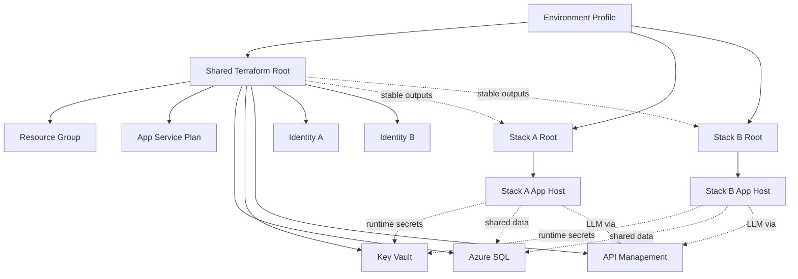

# Data Model: Selective Azure Deployment

**Feature**: 006-selective-azure-deploy
**Date**: 2026-04-17

> This feature models deployment state, reusable Azure resources, environment profiles,
> and workflow decisions rather than application-domain entities.

## Core Deployment Entities

### 1. Environment Profile

Represents one deployment configuration file consumed by Bash wrappers and GitHub Actions.

| Property | Type | Description |
|----------|------|-------------|
| fileName | string | `.env_local`, `.env_qa`, or `.env_prod` |
| tfEnvironment | enum | `dev` \| `test` \| `prod` |
| githubEnvironment | enum | `development` \| `staging` \| `production` |
| location | string | Azure region, e.g. `australiaeast` |
| stackTarget | enum | `shared-only` \| `stack-a` \| `stack-b` \| `both` |
| reuseFlags | map | Boolean `*_REUSE` settings for shared resources |
| existingResourceRefs | map | Name and resource-group pairs for reused resources |

**Relationships**: Drives all Terraform roots and script behavior.
**Validation**: Reuse-enabled entries must provide the required existing resource coordinates.

---

### 2. Shared Terraform Root

Represents `infra/terraform/live/shared` and owns shared platform infrastructure for one environment.

| Property | Type | Description |
|----------|------|-------------|
| environment | string | `dev`, `test`, or `prod` |
| stateScope | string | `shared` |
| outputs | map | Stable outputs for shared resource IDs, URIs, hostnames, and principal IDs |
| reuseAware | bool | `true` |

**Relationships**: Feeds outputs to both stack roots.
**Lifecycle**: Applied before stack roots when shared infrastructure changes; destroyed only through dedicated shared deprovision flow.

---

### 3. Stack Terraform Root

Represents either `infra/terraform/live/stack-a` or `infra/terraform/live/stack-b`.

| Property | Type | Description |
|----------|------|-------------|
| stack | enum | `stack-a` \| `stack-b` |
| environment | string | `dev`, `test`, or `prod` |
| stateScope | string | `stack-a` or `stack-b` |
| dependsOnSharedOutputs | bool | `true` |
| packageArtifact | string | Packaged build output consumed by deployment step |

**Relationships**: Consumes shared outputs; deploys only its own application host and stack-specific configuration.
**Lifecycle**: Can be applied or destroyed independently of the other stack.

---

## Shared Infrastructure Entities

### 4. Resource Group

Primary deployment resource group for managed resources in an environment.

| Property | Type | Description |
|----------|------|-------------|
| name | string | `rg-talentmatch-{env}` |
| location | string | Azure region |
| env | enum | `dev` \| `test` \| `prod` |
| tags | map | `{ environment: env, project: "talentmatch", managedBy: "terraform" }` |

**Relationships**: Contains managed resources created by the shared or stack roots.
**Lifecycle**: Created before managed resources. Reused resources may exist outside this group.

---

### 5. App Service Plan

Shared Linux plan used by both app hosts when it is managed by this feature.

| Property | Type | Description |
|----------|------|-------------|
| name | string | `plan-talentmatch-{env}` |
| sku | string | `B1`, `B2`, `S1`, or `P1V3` |
| reuse | bool | Whether the plan is looked up instead of created |

**Relationships**: Referenced by Stack A and Stack B app hosts.
**Lifecycle**: Owned by the shared root when created here; treated as data-only when reused.

---

### 6. Azure SQL Server and Database

Shared data platform consumed by both stacks in cloud environments.

| Property | Type | Description |
|----------|------|-------------|
| serverName | string | `sql-talentmatch-{env}` or reused server name |
| databaseName | string | `sqldb-talentmatch-{env}` or reused database name |
| aadOnly | bool | `true` |
| minTlsVersion | string | `1.2` |
| reuse | bool | Whether SQL is looked up instead of created |

**Relationships**: Shared by Stack A and Stack B; referenced through stable outputs.
**Ownership Rule**: RBAC or ownership-changing operations are skipped when reuse is enabled.

---

### 7. Key Vault

Per-environment vault for shared runtime secrets.

| Property | Type | Description |
|----------|------|-------------|
| name | string | `kv-talentmatch-{env}` or reused vault name |
| enableRbacAuthorization | bool | `true` |
| secrets | list | `sql-connection-string`, `openai-api-key`, `awr-api-key` |
| reuse | bool | Whether the vault is looked up instead of created |

**Relationships**: Referenced by both app hosts for runtime secret resolution.
**Ownership Rule**: Secrets and role assignments are managed only when the vault is created by this feature.

---

### 8. API Management

Shared API gateway protecting Azure OpenAI access.

| Property | Type | Description |
|----------|------|-------------|
| name | string | `apim-talentmatch-{env}` or reused APIM name |
| sku | string | `Consumption`, `Developer`, or `Basic` |
| backendType | string | Azure OpenAI |
| reuse | bool | Whether APIM is looked up instead of created |

**Relationships**: Both stacks route LLM traffic through APIM.
**Ownership Rule**: Policies or role assignments that would alter external governance are skipped on reused APIM instances.

---

### 9. User-Assigned Managed Identity

Identity assigned to one stack's app host.

| Property | Type | Description |
|----------|------|-------------|
| name | string | `id-talentmatch-{stack}-{env}` |
| stack | enum | `node` or `blazor` |
| reuse | bool | Whether the identity is created or looked up |

**Relationships**: Attached to the corresponding app host.
**Ownership Rule**: Reused identities are referenced but not modified.

---

### 10. App Service Host

Application host for either Stack A or Stack B.

| Property | Type | Description |
|----------|------|-------------|
| name | string | `app-talentmatch-node-{env}` or `app-talentmatch-blazor-{env}` |
| stack | enum | `stack-a` \| `stack-b` |
| runtime | string | `NODE|20-lts` or `.NET 10` |
| httpsOnly | bool | `true` |
| identityRef | string | Resource ID of user-assigned managed identity |
| sharedOutputRefs | map | Key Vault URI, SQL connection setting source, APIM endpoint |

**Relationships**: Deployed by the matching stack root and bound to shared outputs.
**Lifecycle**: Can be updated or destroyed without impacting the other stack.

---

## Workflow Entities

### 11. Selective Deployment Workflow

Represents `.github/workflows/selective-azure-deploy.yml`.

| Property | Type | Description |
|----------|------|-------------|
| trigger | list | `push`, `workflow_dispatch` |
| targetSelection | enum | `shared-only` \| `stack-a` \| `stack-b` \| `both` |
| deployShared | bool | Whether shared root is applied |
| deployStackA | bool | Whether Stack A package and deploy steps run |
| deployStackB | bool | Whether Stack B package and deploy steps run |

**Relationships**: Calls Bash wrappers and packaging scripts.
**Validation**: Manual target selection overrides path-detection results.

---

### 12. Federated Deployment Identity

Azure app registration and federated credential set used by GitHub Actions.

| Property | Type | Description |
|----------|------|-------------|
| subject | string | `repo:{org}/{repo}:environment:{env-name}` |
| tokenFlow | string | GitHub OIDC to Azure access token exchange |
| minimumExternalAccess | string | `Reader` on external reuse resource groups |

**Relationships**: Used by the selective deployment workflow.

---

## State Transitions

### Stack Lifecycle

```text
[Not Provisioned] -- deploy stack root --> [Provisioned]
[Provisioned] -- redeploy --> [Provisioned]
[Provisioned] -- stack deprovision --> [Removed]
```

### Shared Infrastructure Lifecycle

```text
[Not Provisioned] -- apply shared root --> [Provisioned]
[Provisioned] -- reapply --> [Provisioned]
[Provisioned] -- shared deprovision --> [Removed]
```

### Reused Resource Lifecycle

```text
[External Resource Exists] -- lookup via data source --> [Referenced]
[Referenced] -- deploy/deprovision feature --> [Referenced]
```

Note: Reused resources never enter Terraform state as managed resources and therefore are never destroyed by feature deprovisioning.

## Relationship Diagram

